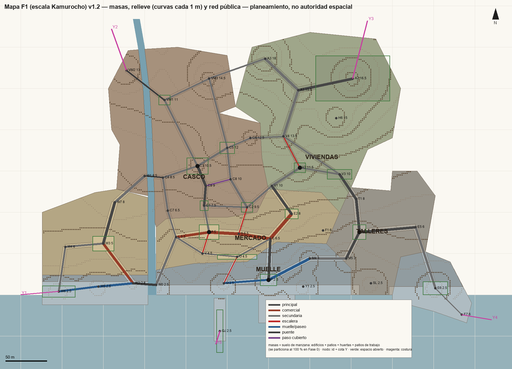
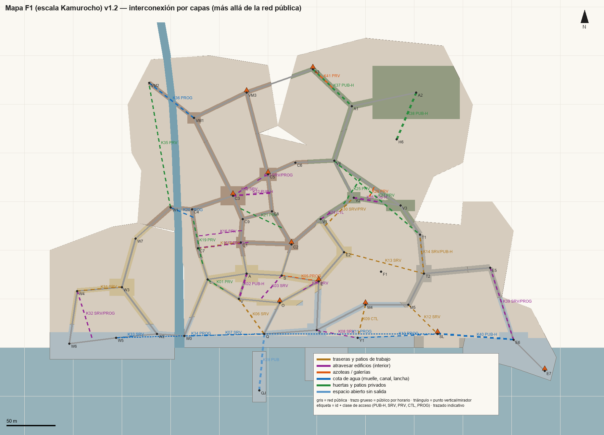
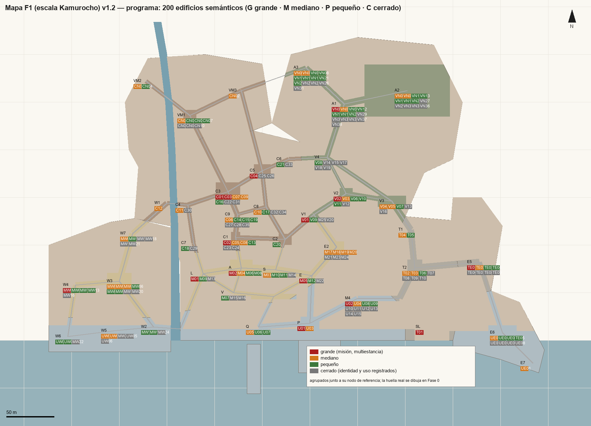

# Plan maestro de ciudad — Mapa F1 v1.2

Status: **WORKER CANDIDATE / PLANNING AUTHORITY PROPOSAL — pendiente de revisión independiente (WP-CITY-MASTER-00)**
Date: 2026-10-01
Owns: plano global del Mapa F1 (escala Kamurocho) y su reserva de crecimiento hasta escala Ijincho; distribución de identidades; red pública y capa de interconexión; inventario de edificios semánticos e interiores; oportunidades; costuras; plan por sectores.
Data: [`city/city_plan_v1.json`](city/city_plan_v1.json) (registro de planeamiento) · métricas reproducibles: `python Tools/city_plan.py metrics` · planos: `python Tools/city_plan.py render`.

> **Planeamiento ≠ keeper.** Las coordenadas son hipótesis de trabajo con tolerancia de realización. En cuanto `WP-CITY-SKELETON-00` siembre las escenas Unity authored, **la escena es la autoridad espacial** y las métricas se re-miden desde ella con las mismas reglas. Todos los nombres son **provisionales**: no se hornean en señalización keeper, assets ni UI.

## 1. Decisiones del Owner registradas (2026-10-01)

| # | Decisión | Consecuencia |
|---|---|---|
| D1 | **ENV01 es donante en escena nueva.** | La ciudad es una escena nueva persistente con autoridad manual. `ENV01_AUTHORED` queda intacta como kit, referencia y donante (FacadeCells, cubiertas, puente, materiales). DENSITY-01 puede seguir en paralelo. No se convierten los 311 cuerpos de ENV01. |
| D2 | **B0 absorbe el piloto CASCO-V2-00.** | B0 (Fase 1) hereda sus criterios físicos (programa antes que geometría, ≥2 plantas jugables, programa profundo ≥3 estancias, utilidad A/U medida, 0 residuales, NPC concurrentes, negativos de acceso). CASCO-V2-00 y la PR #22 quedan superseded. Las PR #23/#24 (reconstrucción 1:1 de Potes) contradicen "no reconstruir literalmente": se marcan como contrarias, sin cerrarlas sin OK explícito. `WP-CITY-URBAN-01` conserva su gate de contenido (civiles CHAR, diálogo, UI). |
| D3 | **Interiores grandes de misión.** | Los 5 obligatorios (pensión, comandancia, ayuntamiento, hotel, bar de misión) + lonja/cofradía, mercado de abastos, almacén portuario, astillero, casa de cultura, iglesia, hogar vecinal; el anillo F1 añade cine-bingo, conservera e instituto. 15/200 = 7,5 % (tope de profundos 20 %). |
| D4 | **Escala: Mapa F1 = Kamurocho, crecimiento hasta Ijincho.** | Primera fase del mapa ≈ 0,12 km² (Kamurocho ≈ 0,12–0,15 km² por estimación; no hay cifras oficiales). Isezaki Ijincho mide ~3× Kamurocho: el crecimiento posterior por las costuras Y1–Y5 apunta a ~0,35–0,40 km². La ciudad compacta de 65.000 m² diseñada primero pasa a ser el **núcleo**; un **anillo F1** dentro de las mismas cinco identidades completa la escala Kamurocho. |
| D5 | **Mayoría real de interiores accesibles.** | Objetivo 60 % de SemanticBuildings con interior recorrible, mínimo duro >50 %. |
| D6 | **Interconexión tipo Sapienza.** | El mapa se interconecta más allá de las rutas principales: traseras, patios de trabajo, interiores que se atraviesan, azoteas y galerías, cota de agua y huertas, con acceso público, por horario, laboral, privado, controlado o desbloqueable. Se mide y se dibuja como una capa propia (§8). |

D4 y D5 enmiendan los presupuestos aceptados en CITY-00R; ver [`COMPACT_SEMANTIC_CITY_REBASELINE.md`](COMPACT_SEMANTIC_CITY_REBASELINE.md#enmienda-owner-2026-10-01--mapa-f1-escala-kamurocho-e-interiores-accesibles).

## 2. Diagnóstico del estado real

**Integración de ramas.** `main` (`eacdd58`) es la autoridad documental (CITY-00R PASS, CASCO-V2-00, Director-00, MAST-00, ANIM-01). **La PR #25 `ENV01_AUTHORED` está mergeada en `worker/casco-diag-01`, no en `main`**: la cadena es `main ← PR #10 worker/prod-env-01 (abierta, ENV-01 sin PASS) ← worker/casco-diag-01 ← PR #25 + DocSync bfda1ad`. Las dos líneas divergían 49/47 commits y sólo solapaban tres archivos; la rama Unity de la ciudad (`worker/city-skeleton-00`) parte de la cadena ENV y ya incorpora `origin/main`.

**Unity (base bfda1ad).** Unity 6000.3.24f1, URP 17.3, **GC2 Core 2.19.61 únicamente** (sin Dialogue, Inventory, Behavior, Perception ni Melee). `com.unity.ai.navigation` 2.0.15 instalado y sin usar. Player GC2: cápsula 2,0 × r 0,2, 4 m/s, pendiente máx. 45°, escalón 0,3; cámara en tercera persona a 3 m, hombro 0,5, FOV 55. No hay NPC, rutinas, reloj de juego (sólo presets de luz día/tarde/noche) ni puertas funcionales (marcadores `THR_*`).

**ENV01.** 196 × 236 m (46.256 m²), 311 cuerpos (224 en el trabajo DENSITY-01 sin commitear), 38 calles = 1.438 m de red, plaza de 1.322 m², río de 9 m que fluye al **norte**, **0 interiores transitables**. Kit reutilizable: 183 módulos, 24 unidades, 293 materiales, familias de fachada, `ShopInterior` (~4 m) y `LodgingVestibule`. Herramientas: `JDRouteProbe`, `EnvWalk`, `EnvShots`, `EnvSemantics`, `JDSpatialIdentity`, `EnvAuthoredGuard`.

**Aceptado vs propuesta.**

| Aceptado | Propuesta / abierto |
|---|---|
| CITY-00 + CITY-00R (gramática `FacadeCell ≠ SemanticBuilding ≠ InteriorProgramme`, 0 espacio residual), B0 L/A/S/E/P/Q/O/V y B01–B10, U01–U07, 70/20/10, cinco identidades | `CASCO_MASTER_LAYOUT_V1` (sin commitear), DENSITY-01 (sin commitear), POTES #23/#24, piloto Block 10 #22 |
| ENV01_AUTHORED como autoridad espacial **de ENV01** (cadena ENV) | ENV-01 PASS, Director D0/D1 PASS, MAST (bloqueado hasta D1) |
| ASSET-00, ANIM-01 (19 motions admitidos) | CHAR-01, M0, Dialogue, UI, NavMesh, rutinas, puertas reales |

**Consecuencia.** ENV01 no sirve como CASCO in situ (orientación río→norte opuesta, 311 cuerpos estrechos con 0 interiores, red casi del tamaño de todo el núcleo). Se usa como kit y donante (D1). Director/MAST no se usan: su contrato opera sobre trace→rebuild de ENV01 (bloqueado por PR #25) y MAST espera a D1 PASS.

## 3. Concepto espacial — anfiteatro sobre la dársena

La ciudad asciende desde una **dársena al sur**. Un río pequeño y encajonado baja del **valle de los molinos** por el oeste del casco y desemboca junto al **Puente de la Ría**, donde llega el autobús (Luarca: agua, puentes y vida diaria juntos). El **CASCO** ocupa el espolón noroeste y asoma su proa, **La Atalaya**, sobre el puerto (Castropol y San Vicente de la Barquera: núcleo elevado frente al borde de agua; Potes/Liébana: irregularidad, fachadas estrechas, piedra y revoco, cubiertas y cambios de cota). **MERCADO** es la banqueta media entre casco y puerto (B0) y cruza el río en el **Arrabal de la Ría** (estación, cine-bingo, hostal). **MUELLE** es el borde de agua de trabajo, de la playa de la Ría al faro. **TALLERES** cierra el este con varadero, conservera y rampas de camión. **VIVIENDAS** sube por la ladera nordeste en terrazas curvas con huertas (Lastres/Cudillero) hasta las **afueras altas** del instituto y el campo de fútbol. De Getaria/Mutriku se toma la eficacia calle-mayor→puerto y el paso cubierto bajo edificio.

Ritmo: **compresión → expansión → revelación**. Ejemplo B0: calle comercial cerrada → plaza del mercado con un hueco hacia el agua por la Escalinata (vista parcial) → esquina E donde el hotel y la bajada enmarcan la dársena (revelación) → explanada de la lonja (expansión).

## 4. Planos a escala

Escala 1 px = 0,33 m; cuadrícula de 50 m; norte arriba. "Masas" = suelo de manzana (edificios + patios + huertas + patios de trabajo) que la Fase 0 particiona al 100 %. Curvas de nivel interpoladas desde las cotas de nodo (indicativas). Magenta: costuras Y1–Y5 hacia la escala Ijincho.

## 5. Identidades y presupuesto del Mapa F1

| Identidad | Núcleo | Anillo F1 | Área F1 | Edificios | Cotas Y (m) |
|---|---|---|---:|---:|---|
| CASCO | espolón: Vinos, Atalaya, Rúa, Plaza Mayor, iglesia, río y Puente Viejo | Valle de los Molinos: molinos, lavadero del río, ermita del Alto | 31.526 m² (26 %) | 45 | 6,5–14,5 |
| VIVIENDAS | ladera en terrazas: fuente, lavadero, casa-cuartel, hogar, frontón | Afueras altas: instituto, campo de fútbol, bloques de los 70, casas baratas, chalés | 29.452 | 58 | 10–18 |
| MERCADO | B0, mercado de abastos, pensión, hotel, Cantón | Arrabal de la Ría: estación de autobuses, cine-bingo, hostal, videoclub | 24.620 | 49 | 4,5–8 |
| MUELLE | paseo P–Q, lonja/cofradía, almacenes, patio controlado, armadores, espigón | Playa y paseo de la Ría (cetárea, club de remo); ensenada y faro | 23.316 | 29 | 2,5–6 |
| TALLERES | astillero/varadero, taller mecánico, La Nave | Conservera, desguace, taller de motos | 12.654 | 19 | 3–8 |
| **Total F1** | 64.766 m² | 56.802 m² | **121.568 m²** | **200** | mayor/menor **2,49×** |

Envolvente: incluye cauce del río, calles, patios, huertas, muelles, playa y ribera; excluye la lámina de la dársena. La escala Kamurocho se alcanza con **suelo con función** (campo de fútbol, playa, conservera, patios de trabajo, huertas), no con calles vacías. CASCO es la mayor identidad junto a VIVIENDAS; TALLERES la menor.

## 6. Relieve

| Banqueta | Y (m) | Contenido |
|---|---:|---|
| lámina de agua | 0 | dársena; río encajonado (4–6 en el casco, entre muros de 3 m) |
| muelle, playa y ensenada | 2,5–3 | paseo P–Q, lonja, patio portuario, varadero, Paseo de la Ría, ensenada |
| terraza El Muro (B0) | 4,5 | rellanos O y V, ruta elevada sobre el muelle |
| calle comercial (B0), Arrabal | 5–6,5 | pensión, plaza del mercado, tienda, hotel, estación |
| Cantón / Talleres / Conservera | 5–8 | Calle Nueva, Alto de la Cantera, puerta de la conservera |
| CASCO bajo | 7,5–9,5 | Calle de los Vinos, Atalaya |
| Plaza Mayor | 10,5 | ayuntamiento, casa de cultura |
| CASCO alto y valle | 11–14,5 | iglesia, lavadero del río, molino de arriba, ermita |
| VIVIENDAS y afueras | 10–18 | fuente, terrazas, instituto, campo, Barrio Alto |

**Sección B0 (N→S):** calle comercial (6,5) │ edificios del lado sur con planta baja a dos cotas (fachada a la calle y bodega/almacén a la terraza) │ terraza El Muro V–O (4,5) con pretil │ muro de 2 m y Escalera del Muro Q–O │ muelle (2,5) │ dársena. Crea la ruta alternativa elevada, accesos de servicio legítimos y la revelación progresiva del puerto.

Pendientes por longitud de red pública: **81 % ≤5 % · 14 % 5–10 % · 5 % >10 % o escaleras** (intención 70/20/10; la realización subirá algo de "perceptible" en CASCO y VIVIENDAS sin convertir la ciudad en una sucesión de escaleras).

## 7. Red pública

Anclas: CASCO = Plaza Mayor (C3) · MERCADO = plaza del mercado (A) · MUELLE = umbral del puerto (P) · TALLERES = patio de talleres (T2) · VIVIENDAS = plazuela de la Fuente (V2).

| Grupo | Ejes (ancho objetivo, m) | m |
|---|---|---:|
| B0 | B01 L–A 6 · B02 A–S 7 · B03 S–E 7 · B04 E–P 6 (U01) · B05 P–Q paseo 4,5 · B06 Q–O escalera 2,5 (U02) · B07 O–E 3,5 · B08 O–V terraza 3,5 · B09 V–A escalonada 2,5 · B10 L–V 3,5 | 452 |
| Llegada y río | Calle de la Ría W0–L 4,5 · Calle del Río sur y norte 3,5–4 · Puente Viejo 3,5 | 173 |
| CASCO | Cuesta del Mercado (U03) 4 · Calle de los Vinos 4 · Escalera de la Atalaya 2,5 · Rúa Mayor 5 · Pasadizo de la Atalaya (cubierto) 3 · Calle de la Atalaya 4 · Cuesta del Puente Viejo 4 · Calle de la Iglesia 4 · Calle Real 4 · Ronda Alta 3,5 | 443 |
| MERCADO norte | Calle Nueva (U04) 7 · Calle Nueva alta (U04) 6 · Calle de San Roque 4 | 133 |
| VIVIENDAS | Camino Alto (U05) 3,5 · Calle de la Fuente 4 · Calle del Lavadero 4 · Escalerilla de las Huertas 2,5 · Ronda de las Terrazas 3,5 | 294 |
| TALLERES y MUELLE | Rampa de la Cantera (U07) 6 · Rampa de Talleres 6 · Rampa del Varadero 6 · Calle del Muelle (U06) 5 · Calle de los Almacenes (U06) 5 | 239 |
| Arrabal de la Ría | Puente de la Ría 5 · Calle de la Estación 6 · Calle del Cine 4,5 · Paseo de la Ría 5 · Paseo de la Playa 4,5 · Bajada de la Playa 4 · Cuesta de la Estación 6 · Carretera vieja del valle 5 | 413 |
| Valle de los Molinos | Calle de los Molinos 4 · Puente de los Molinos 3,5 · Cuesta de la Ermita 3,5 · Camino de la Ermita 3,5 | 331 |
| Afueras altas | Calle del Instituto 5 · Avenida del Campo 6 · Calle de los Bloques 5 · Camino del Alto 3,5 | 281 |
| Costa este | Calle de la Conservera 6 · Bajada de la Ensenada 4,5 · Senda del Faro 3 | 214 |
| **Red pública F1** | **57 ejes, 43 nodos, 15 ciclos independientes, un solo componente** | **2.973 m** |
| + exterior público por horario | Callejón del Tinte (bar), patio del instituto, grada del campo, senda de las rocas con marea baja | **3.209 m** (tope F1 3.600) |

**Clases de acceso.** `PUB` público · `PUB-H` público por horario · `SRV` laboral o de servicio (trabajo o permiso) · `CTL` controlado (patio portuario, interior de la casa-cuartel) · `PRV` privado (invitación o llave) · `PROG` se abre tras misión · `SCN` costura escénica no transitable. **Ningún requisito de conectividad pública depende de un interior**; las conexiones interiores son aristas adicionales, condicionadas y registradas.

**Jerarquía legible.** Comercial (Calle del Comercio, Calle Nueva, Calle de la Estación: 6–7 m, escaparates, toldos) · principal (Rúa Mayor, bajadas, rampas, Avenida del Campo: 5–6 m) · secundaria (3,5–5 m, giros cada 15–25 m) · escaleras, callejas y paso cubierto (2,5–3 m, acento) · paseo portuario (4,5–5 m). Anchuras a validar con el Player GC2, su cámara y agentes NPC; se corrigen localmente, no ensanchando toda la ciudad.

## 8. Capa de interconexión (Sapienza)

Inspiración: en Sapienza la ciudad se aprende primero por sus calles y después se descubre que casi todo se toca con casi todo: jardines, cocinas y escaleras de servicio, sótanos, azoteas y senderos costeros, con zonas públicas y controladas conviviendo. Aquí cada identidad tiene, además de la calle, **al menos tres capas** adicionales, y todas sirven también para conversar, trabajar, observar y seguir personas:

| Capa | Ejemplos (41 enlaces, 1.959 m caminables) |
|---|---|
| Traseras y patios de trabajo (8) | Pasaje de las Bóvedas bajo El Muro (muelle ↔ carga del mercado, SRV) · patio portuario (CTL) · Callejón y Patio de la Fábrica (Cantón ↔ Talleres, SRV) · cadena de patios de Talleres · Callejón del Tinte por el patio del bar (PUB-H) · Callejón de la leña con el butanero (SRV/PRV) · andenes y cocheras de la estación (SRV) |
| Atravesar edificios (13) | mercado de abastos a dos cotas (PUB-H 7–14 h) · almacén de la tienda S a la terraza (SRV) · cocina y escalera de servicio del hotel (SRV) · lonja de la galería al muelle (SRV) · panadería con obrador (SRV 06:00) · bodega del bar al río (PROG) · archivo del ayuntamiento (SRV) · Casa de Cultura de fachada a fachada (PUB-H) · coro de la iglesia → casa rectoral (PRV/PROG) · casa-cuartel al portón lateral (CTL) · Hogar a su terraza (PUB-H) · cine-bingo por la cabina de proyección (SRV/PROG) · conservera de la nave a la ensenada (SRV/PROG) |
| Azoteas y galerías (3) | Azoteas del Comercio (hotel ↔ tienda, PROG) · corredor de galerías de las casas en terraza (PRV) · azoteas y tendederos de los bloques de los 70 (PRV) |
| Cota de agua (8) | muelle de armadores (SRV) · puerta trasera del almacén al varadero por el agua (PROG) · canal del molino viejo (PROG) · canal de los molinos (PROG) · cetárea (SRV) · senda de las rocas con marea baja (PUB-H) · lancha de armadores y traineras del club de remo por la dársena (PROG, no caminables) |
| Huertas y patios privados (8) | patio de la pensión (llave de huésped) · Huertas de la Ribera junto al cauce · patio de la casa del maestro · escaleras privadas entre terrazas · Senda de las Huertas altas → Talleres · senda de huertas de la ribera oeste · patio del instituto (PUB-H) · grada del campo → huertas (PUB-H) |
| Puntos verticales (10) | torre de la iglesia, galería del hotel, balcón de plenos, entreplanta del almacén, Atalaya, terraza El Muro, altillo del astillero, faro, ermita del Alto, azotea de los bloques |

**Efecto medido** (todas las condiciones abiertas; rutas más cortas y alternativas independientes por aristas):

| Par | Sólo red pública | Con capas | Alternativas pública → con capas |
|---|---:|---:|---:|
| pensión → puerto | 184 m | 145 m | 3 → 4 |
| tienda S → terraza El Muro | 93 m | 46 m | 3 → 3 |
| Calle del Río → Calle de los Vinos | 121 m | 51 m | 2 → 4 |
| Cantón → talleres | 238 m | 100 m | 2 → 3 |
| puerto → talleres | 147 m | 147 m | 2 → 4 |
| muelle → varadero | sin ruta pública | 191 m | 0 → 3 |
| Viviendas → Alto de la Cantera | 100 m | 99 m | 2 → 4 |
| pensión → Plaza Mayor | 132 m | 128 m | 3 → 4 |

Reglas: una conexión de capa nunca es requisito de conectividad pública; las privadas y controladas no se vuelven atajos públicos gratuitos; cada una tiene dueño, función, condición y razón espacial (no hay agujeros en muros "para el jugador"); se recorren andando, sin saltos ni habilidades ajenas al juego. Estado de todas: `SPATIALLY_PREPARED_PLANNED`.

## 9. Métricas del Mapa F1

| Medida | Valor v1.2 | Tope F1 | |
|---|---:|---:|---|
| Envolvente | 121.568 m² | ≤150.000 | ✓ |
| Mayor / menor identidad | 2,49× | ≥2 | ✓ |
| Red pública | 2.973 m (+ exterior PUB-H: 3.209 m) | ≤3.600 | ✓ |
| Edificios semánticos | 200 (CASCO 45) | ≤240 (≤50) | ✓ |
| Vecinos funcionales por ruta | CASCO–MERCADO 97 · MERCADO–MUELLE 142 · CASCO–VIVIENDAS 176 · MERCADO–VIVIENDAS 168 · MUELLE–TALLERES 147 · TALLERES–VIVIENDAS 147 | ≤180 m | ✓ (CASCO–VIVIENDAS justo) |
| Extremos | 759 m (cine-bingo ↔ faro), ≈4,2 min a 3 m/s, ≈3,2 min corriendo a 4 m/s | ≤900 m | ✓ |
| Interiores accesibles | 120/200 = 60 % | objetivo 60 %, mínimo >50 % | ✓ |
| Interiores profundos | 15/200 = 7,5 % | ≤20 % | ✓ |
| Capas por identidad | 4–5 además de la calle | ≥3 | ✓ |
| Ruta directa vs alternativa B0 | L→P directa 187 m · por terraza 184 m · con capas 145 m | elección real | ✓ |

Fuente: `python Tools/city_plan.py metrics` → [`METRICS.json`](../evidence/WP-CITY-MASTER-00/METRICS.json) (todas las comprobaciones pasan). Son métricas de planeamiento; las vinculantes se re-miden desde la escena en la Fase 0. Comparación de escala: Kamurocho se cruza andando en ~9:20 min y corriendo en ~2:36 min (medición pública de Yakuza 0); el extremo del Mapa F1 se recorre corriendo en ~3:10 min.

## 10. Inventario de edificios semánticos e interiores

| Identidad | Grandes (misión) | Medianos | Pequeños | Cerrados | Accesibles |
|---|---|---|---|---:|---:|
| CASCO 45 | Ayuntamiento · **Bar de misión** · Casa de Cultura · Iglesia | pub nocturno · mesón · farmacia con rebotica · panadería con obrador · gestoría/notaría · casa del maestro · piso de la víctima · molino viejo · molino de arriba · ermita del Alto · bar de los Molinos | estanco · barbería · mercería · papelería · zapatero · lavadero del río · casa del molinero · 6 casas | 17 | 28 (62 %) |
| MERCADO 49 | **Pensión** · **Hotel** · Mercado de abastos · Cine-Bingo | tienda-testigo S · café-bar del mercado · Foto Estudio · salón recreativo · Correos · caja de ahorros · estación de autobuses · hostal de la estación · bar de la estación · taller y gasolinera | kiosco · ferretería · carnicería · frutería · droguería · peluquería · casa de la terraza · videoclub · locutorio · electrodomésticos · loterías · farmacia de la estación · casa de comidas · panadería de la Ría · casa del Arrabal · antigua fonda | 19 | 30 (61 %) |
| VIVIENDAS 58 | **Comandancia (casa-cuartel)** · Hogar / Asociación vecinal · Instituto | tienda de barrio · casa de familia · frontón + vestuarios · vestuarios y bar del campo · bar del Barrio Alto · ultramarinos del Alto · chalé del indiano · pabellón y club de boxeo | 14 casas visitables · quioscos · peluquería · piso de estudiante · taller de bicis · academia · guardería · estanco · mercería | 24 | 34 (59 %) |
| MUELLE 29 | Lonja + Cofradía · Almacén portuario | bar del puerto · oficina del puerto · nave de redes · cetárea · club de remo · faro · antigua lonja | 2 casetas de aparejos · efectos navales · despacho de hielo · salvamento · chiringuito · merendero · caseta de redes | 12 | 17 (59 %) |
| TALLERES 19 | Astillero + varadero · Conservera | taller mecánico · La Nave · almacén de materiales · desguace | casa de comidas · cerrajería · taller de motos · almacén de butano · carpintería de ribera | 8 | 11 (58 %) |
| **200** | **15** | **40** | **65** | **80** | **120 (60 %)** |

El ledger completo (ID, identidad, sector, nodo, FacadeCells estimadas, plantas visuales, clases de acceso, nota) está en `city_plan_v1.json → buildings`. Todo edificio cerrado tiene identidad y uso. Varias tiendas en un edificio no cuentan como varios accesibles; una ventana con habitación simulada no cuenta como interior.

### 10.1 Programas grandes (dimensionados desde ocupación; se validan en Unity)

| Edificio | Superficie y plantas | Programa | Oportunidad de juego |
|---|---|---|---|
| **Pensión** (M01, B0) | ~260 m², 2 plantas jugables | recepción, comedor-salón común, cocina, lavadero y patio, 6–8 habitaciones (incl. la del protagonista), piso de la dueña, escalera trasera; 8–10 ocupantes | ancla de retorno con respuesta cambiada; salida trasera de huésped |
| **Hotel** (M05) | ~450 m², 3 plantas, dos cotas | vestíbulo y recepción, bar-cafetería, comedor, cocina y office con puerta SRV a la bajada, escalera de servicio, pasillos de habitaciones, galería acristalada al puerto | otra clientela (viajantes, forasteros, dinero); vigilar el muelle; ruta de servicio |
| **Comandancia (casa-cuartel)** (V01) | ~500 m² | mostrador y espera públicos; oficinas, sala de declaraciones, calabozo, armero, archivo, patio de vehículos (CTL) con portón lateral; viviendas de guardias con acceso propio | denuncia, declaración, archivo; patio visible desde la Escalerilla |
| **Ayuntamiento** (C01) | ~420 m², 2 plantas | registro/padrón, oficinas técnicas (licencias), archivo con puerta SRV trasera, alcaldía, salón de plenos con balcón, conserjería/policía local | padrón y licencias para investigar; balcón sobre la plaza |
| **Bar de misión** (C02) | ~240 m² + bodega | barra, sala con billar y dardos, cocina, trastienda de partidas, bodega con puerta PROG al río, patio de servicio, piso del dueño | social y nocturno; trastienda; loop tras misión; patio de pelea |
| Mercado de abastos (M02, B0) | ~600 m², dos cotas | puestos, cámaras, muelle de carga a la terraza, administración | conexión interior PUB-H 7–14 h; seguimiento entre puestos |
| Lonja + Cofradía (U01) | ~650 m² | galería de subasta, sala de clasificación, cámara, oficinas y archivo de la cofradía | subasta al alba; descarga; registros de ventas y barcos |
| Almacén portuario (U02) | ~550 m² | nave con entreplanta-oficina, muelle de carga, puerta trasera al varadero | trabajo; observación del patio; loop PROG por el agua |
| Astillero de ribera (T01) | ~450 m² | nave con barco en grada, carpintería, altillo | reparación; escondite; acceso por agua |
| Casa de Cultura (C03) | ~400 m² | biblioteca y hemeroteca 1999–2003, salón de actos, exposición | investigación documental; ensayos por la tarde |
| Iglesia (C04) | ~350 m² | nave, coro, sacristía, archivo parroquial, torre | archivo de nacimientos y defunciones; mirador condicionado |
| Hogar / Asociación vecinal (V02) | ~300 m² | bar-social, sala de juegos, salón de asambleas | centro de día → partidas → asamblea; rumores |
| Cine-Bingo (MW01) | ~550 m², 2 plantas | sala de bingo (antiguo patio de butacas), bar, cabina de proyección, oficina, almacén trasero | juego y deudas; trastienda; observar la sala desde la cabina |
| Conservera (TE01) | ~800 m² | nave de envasado, cocederos, cámaras, oficinas, muelle propio | trabajo por turnos; contrabando; huida al mar |
| Instituto (VN01) | ~900 m², 2 plantas | aulas, pasillos, sala de profesores, archivo, gimnasio, patio | estudiantes como testigos; archivo; gimnasio de noche |

### 10.2 Estándares de interior (hipótesis a validar en B0)

Estancia mínima 3,5 m de lado y altura libre ≥2,8 m; pasillos ≥1,5 m; puertas ≥1,0 m (públicas dobles 1,6 m) y ≥2,22 m de alto; escaleras ≥1,2 m con tabica ≤0,16 m y huella ≥0,30 m; perfil de cámara de interior GC2 (tercera persona más corta) activado por trigger, nunca primera persona. Pequeño: 20–45 m² útiles, ≤4 ocupantes. Mediano: 50–150 m², 3–5 espacios incluido servicio, 6–15 ocupantes. Grande: 180–900 m², ≥5 estancias de actividad, ≥2 plantas o medias cotas, circulación pública/privada/servicio, 10–40 ocupantes.

## 11. Actividad, NPC y vida cotidiana

**Combate** (cada forma la explica su uso diario): patio de servicio del bar de misión (≈10×12) · plaza del mercado de noche sin puestos · explanada lonja/almacén de noche (CTL) · patio del taller mecánico · patio del desguace · frontón y pabellón de boxeo (entrenamiento y sparring) · espigón · playa de la Ría en marea baja.

**Persecución:** loops B0 A–S–E–O–V–A y E–P–Q–O–E; loop del CASCO con la Escalera de la Atalaya y el Pasadizo de la Atalaya como atajos aprendidos; loop del río por el patio del bar; loop del valle C3–molinos–ermita–iglesia; loop de las afueras instituto–bloques–Camino del Alto; vuelta transversal sin centro único. Las capas añaden huidas por azoteas, bóvedas, huertas y la senda de las rocas.

**Seguimiento:** oclusiones breves en la esquina E, la Escalera de la Atalaya, los puestos del mercado, las columnas de la lonja, la curva de la Rúa y el Pasadizo; puntos de recuperación en nodos con destino reconocible (Cantón, Plaza Mayor, Atalaya, P, Plaza de la Estación). La terraza El Muro y la ermita del Alto permiten observar desde arriba.

**Trabajos y minijuegos con superficie reservada:** descarga de cajas muelle→lonja · turnos en la conservera · reparto de butano y de pan · dardos y billar (bar) · bingo · recreativo · pesca (espigón y rocas) · fotografía (Atalaya, Foto Estudio) · pelota (frontón) · boxeo (pabellón) · remo (club de remo) · fútbol (campo) · reparación (taller, astillero). Cada uno reserva actividad, operarios, clientes, espera, cámara y acceso.

**Vida NPC fuera del eje:** bancos del muelle, puerta del bar, escalones de la iglesia, plaza del mercado, terraza del Hogar, fuente y lavaderos, sala de espera de la estación, grada del campo, comedor del taller, merendero de la ensenada.

**Rutinas tipo (rutas públicas más cortas):**

| Persona | Recorrido | m |
|---|---|---:|
| Pescador que vive en VIVIENDAS | casa → lonja (05:00) → bar de misión (tarde) → casa | 527 |
| Tendera de la tienda S | tienda → mercado → iglesia → tienda | 308 |
| Dueña de la pensión | pensión → mercado → Correos → Hogar → pensión | 469 |
| Guardia civil | casa-cuartel → Cantón → bajada → muelle → terraza El Muro → casa-cuartel | 389 |
| Operario del almacén que vive en el CASCO | Rúa → almacén → comida en Talleres → bar → casa | 712 |
| Joven de Talleres | La Nave → recreativo → Atalaya → Vinos → La Nave | 679 |

Las capas acortan varias de ellas (el operario por el Callejón de la Fábrica, el joven por el patio del bar), lo que da al jugador formas de anticipar destinos. La geometría admite el sistema de NPC del proyecto (GC2 Core + navegación nativa) sin inventar otra IA para justificar el mapa.

## 12. Oportunidades y secretos (preparadas espacialmente, no gameplay implementado)

| ID | Identidad | Tipo | Qué | Cómo se percibe | Condición | Utilidad |
|---|---|---|---|---|---|---|
| OP01 | CASCO/MERCADO | servicio descubierto siguiendo una rutina | el panadero sale a las 06:00 por el obrador | puerta del obrador abierta al amanecer | 06:00–07:00 | atajo y escucha junto al bar |
| OP02 | VIVIENDAS | patio visible desde otro nivel | patio de vehículos de la casa-cuartel | desde la Escalerilla, por encima del muro | acceso CTL | observar vehículos y detenidos |
| OP03 | MERCADO | cambio de uso por la tarde | plaza del mercado: puestos → partidas → terraza | mobiliario y gente por franja | horario | encuentros distintos por hora |
| OP04 | VIVIENDAS | cambio de uso | Hogar: centro de día → partidas → asamblea | rótulos y gente | horario | rumores, testigos mayores |
| OP05 | CASCO | trastienda relevante | trastienda del bar de misión | puerta tras la barra | confianza / progreso | información y conflicto |
| OP06 | MERCADO | trastienda relevante | laboratorio del Foto Estudio | luz roja tras la cortina | permiso | pista fotográfica |
| OP07 | CASCO | mirador para observar una llegada | La Atalaya sobre la bocana y el puente | vista tras la Escalera de la Atalaya | público | ver quién llega |
| OP08 | MERCADO | mirador para observar una llegada | galería del hotel sobre la dársena | acristalada, visible desde el muelle | cliente / permiso | vigilar muelle y lonja |
| OP09 | MUELLE/TALLERES | acceso que abre un loop tras misión | puerta trasera del almacén al varadero | portón con cadena | PROG | loop por el agua |
| OP10 | CASCO | acceso que abre un loop tras misión | bodega del bar al río | puerta con reja al río | PROG | loop y huida |
| OP11 | MERCADO | conexión interior autorizada | mercado de abastos entre plaza y terraza | dos puertas a cotas distintas | PUB-H 7–14 h | atajo temporal |
| OP12 | MERCADO | conexión interior autorizada | almacén de la tienda S a la terraza | puerta de carga | SRV por confianza | salida discreta |
| OP13 | CASCO | mirador condicionado | torre de la iglesia | campanario visible desde todo el casco | PROG vía sacristán | vista del pueblo |
| OP14 | MERCADO | salida secreta del ancla de retorno | patio de la pensión a la Calleja | puerta con llave de huésped | PRV | salir sin ser visto |
| OP15 | TALLERES | cambio de uso por la noche | La Nave: almacén de día, bar y ensayo de noche | persianas, música, motos | horario | nightlife alternativa |

Las capas del §8 multiplican estas oportunidades en el anillo (cabina del cine-bingo, cocederos de la conservera, gimnasio del instituto de noche, senda de las rocas con marea baja, canal de los molinos). Ninguna es una quest implementada; en Fase 0/1 se construye y valida su espacio con una prueba representativa (variables GC2 de depuración para horario y progreso).

## 13. Crecimiento hacia escala Ijincho

Las costuras X1–X4 de la primera versión quedan **absorbidas** por el anillo F1. El Mapa F1 deja cinco costuras nuevas, cada una con tramo real, cierre honesto, corredor reservado (≥6 m rodado o ≥4 m peatonal) y **suelo exterior reservado** que no cuenta en presupuesto hasta su WP:

| ID | Desde | Zona futura posible | Cierre honesto hoy |
|---|---|---|---|
| Y1 | Playa de la Ría (W6) | costa oeste: carretera, estación de tren, barrio de la playa grande | curva con quitamiedos y señal de salida |
| Y2 | Molino de arriba (VM2) | valle arriba: huertas, cementerio, aserradero | camino entre muros que se pierde valle arriba |
| Y3 | Campo de fútbol (A2) | norte: carretera nacional, polígono, gasolinera | rotonda en obras y vallas |
| Y4 | Faro (E7) | este: playa grande, camping, acantilados | senda cortada por desprendimiento |
| Y5 | Espigón (QJ) | otra orilla: barrio de pescadores y astillero grande (lancha/ferry) | embarcadero sin servicio |

Regla: cada fase de mapa posterior (F2, F3…) entra con su propio WP y enmienda de presupuesto (área, red, edificios, extremos). El objetivo de crecimiento es ~0,35–0,40 km² (escala Ijincho); el núcleo y el anillo F1 no se reconstruyen para ello. A esa escala el extremo de ruta supera 1 km: habrá que decidir entonces transporte en juego (autobús, taxi, lancha) en lugar de alargar paseos vacíos.

## 14. Riesgos principales

1. **Volumen de interiores (120).** Es el mayor coste de ENV. Sin kit modular y mobiliario por programa no escala → se prueba en B0 antes de ampliar; los sectores del anillo van después del núcleo.
2. **Tejido sin contenido.** Kamurocho funciona por densidad de cosas que hacer; el anillo debe llegar con su actividad (estación, cine-bingo, playa, campo, conservera), no como relleno. Si un sector no la tiene, se reduce o se aplaza.
3. **Manzanas grandes (≈89.000 m² de suelo de manzana).** La regla de 0 residuales obliga a particionarlas con función en la Fase 0; si no se justifica, se absorbe en edificios (hasta 240) o se reduce la envolvente, nunca con calles nuevas.
4. **Cámara en interiores pequeños** (cámara a 3 m): perfil de interior y mínimos de estancia.
5. **Rendimiento:** escenas por sector, static batching, occlusion culling, raíces de interior activables; medir desde la Fase 0.
6. **CASCO–VIVIENDAS a 176/180 m** y extremos a 759/900 m: re-medición tras cada sector.
7. **Corredores Y1–Y5:** el exportador de métricas comprueba que nada los bloquea.
8. **Integración de ramas:** cadena ENV fuera de `main`, escenas LFS grandes, escritor concurrente (DENSITY-01) → worktree aislado y escenas por sector.
9. **Sistemas ausentes** (reloj, rutinas, puertas, combate, persecución, remo, lancha): los accesos por horario/progreso se validan con variables GC2 y se declaran "preparados espacialmente".
10. **Trampa del greybox:** la Fase 0 es blockout declarado; ningún sector es DONE sin construcción keeper con kit ENV.
11. **Dirección contradictoria abierta:** PR #23/#24 (Potes 1:1).

## 15. Plan de producción por sectores

Se distinguen siempre tres estados: **blockout validado**, **sector terminado** y **ciudad terminada**.

| Fase | WP | Alcance | Aceptación |
|---|---|---|---|
| 0 | [`WP-CITY-SKELETON-00`](../workpacks/WP-CITY-SKELETON-00.md) | Mapa F1 completo en blockout recorrible: relieve, agua y río, red pública con escaleras y rampas reales, capa de interconexión, masas por SemanticBuilding, volúmenes de interiores grandes, costuras Y1–Y5 | métricas re-medidas desde la escena dentro de los topes F1; NavMesh entre todas las anclas; `JDRouteProbe` 0 fallos por eje público; capas recorridas; partición del suelo; persistencia; profiler |
| 1 | [`WP-CITY-B0-01`](../workpacks/WP-CITY-B0-01.md) | B0 MERCADO–MUELLE keeper + kit de interiores v1 | prueba completa del encargo con Player GC2; interiores en tres escalas; criterios heredados de CASCO-V2-00; 6 NPC concurrentes; negativos; persistencia; Owner + Reviewer |
| 2 | WP-CITY-S2 | MUELLE este + MERCADO norte (lonja, almacén, hotel, Correos, Foto, recreativo, armadores) | DONE de sector + costuras |
| 3 | WP-CITY-S3 | CASCO bajo (bar de misión, Atalaya, Rúa, Plaza Mayor, ayuntamiento) con donantes ENV01 | DONE de sector |
| 4 | WP-CITY-S4 | CASCO alto y río (iglesia, Casa de Cultura, Puente Viejo, molino viejo) | DONE de sector |
| 5 | WP-CITY-S5 | VIVIENDAS núcleo (casa-cuartel, Hogar, frontón) | DONE de sector |
| 6 | WP-CITY-S6 | TALLERES núcleo (astillero, taller, La Nave) | DONE de sector |
| 7 | WP-CITY-S7 | Arrabal de la Ría (estación, cine-bingo, hostal, playa, cetárea, club de remo) | DONE de sector |
| 8 | WP-CITY-S8 | Costa este (conservera, desguace, ensenada, faro) | DONE de sector |
| 9 | WP-CITY-S9 | Valle de los Molinos (molinos, lavadero, ermita) | DONE de sector |
| 10 | WP-CITY-S10 | Afueras altas (instituto, campo, Barrio Alto, pabellón) | DONE de sector |
| F | WP-CITY-INTEGRATION | recorridos completos, horarios y accesos, variedad, secretos, rendimiento, persistencia, docs | DONE de ciudad (Mapa F1) |

**Sector DONE** (encargo §12): integrado en escena persistente y conectado a sus vecinos; Player GC2 recorre sus rutas y entra en los interiores entregados; cámara, colisiones, puertas, escaleras y rampas funcionan; jerarquía, oclusiones, expansiones y landmarks legibles; espacios de combate, trabajo y minijuegos admiten sus actividades; NPC circulan, esperan y comparten espacio sin bloquear sistemáticamente al jugador; edificios semánticos con identidad, accesos y programa coherentes; interiores grandes funcionales y pequeños utilizables; variedad de assets que sostiene la identidad; persistencia tras guardar, reabrir y Play; evidencia revisable y limitaciones explícitas.

**Mapa F1 DONE:** además, las cinco identidades forman una ciudad continua, topes F1 cumplidos, mayoría de interiores realmente accesibles, interiores grandes hechos y comprobados, distancias entre anclas respetadas, loops y capas con decisiones útiles, B0 supera la prueba completa, oportunidades distribuidas, revisión andando desde la cámara real, comprobaciones técnicas y de rendimiento, y documentación que refleja lo construido.

## 16. Reutilización e investigación

| Candidato | Disposición | Motivo |
|---|---|---|
| GC2 Core (triggers, variables, markers, driver NavMeshAgent, cámara) | USE | ya instalado; autoridad de interacción única |
| `com.unity.ai.navigation` | USE | ya instalado; NavMesh para agentes de validación; no es un sistema de rutinas |
| ProBuilder (paquete oficial gratuito) | USE (verificar versión y licencia al adoptar) | blockout y suelos/cáscaras authored editables a mano |
| Kit ENV (módulos, unidades, materiales, familias de fachada) y ENV01_AUTHORED | USE / DONOR | vocabulario visual y FacadeCells para recomponer |
| `JDRouteProbe`, `EnvShots`, `EnvWalk`, `EnvSemantics`, `JDSpatialIdentity`, `EnvAuthoredGuard` | USE / ADAPT | validación y autoridad manual ya probadas |
| Quaternius Medieval Village / Props | USE / DONOR | interiores y mobiliario (CC0), adaptados |
| `CASCO_MASTER_LAYOUT_V1`, CASCO-V2-DIAG | REFERENCE_ONLY | propuestas y diagnóstico sobre ENV01 |
| ENV Director, MAST, Auto-Building, Geo-Buildings, generadores de interiores | NOT_MATERIAL | contratos no aplicables o prohibidos aquí |
