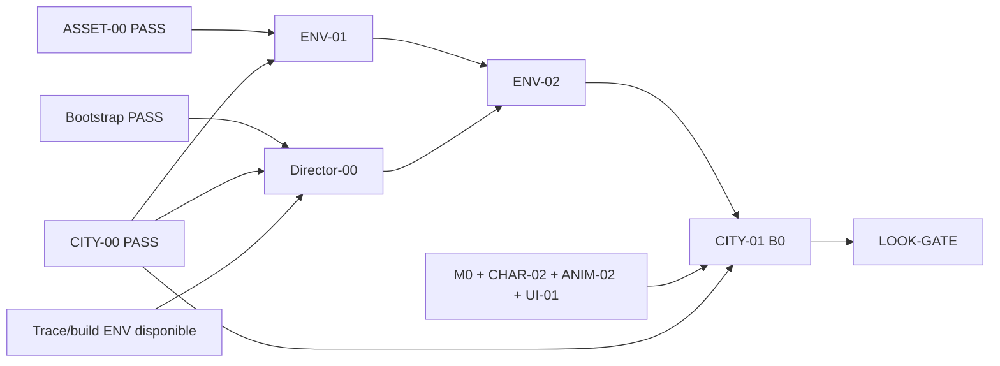
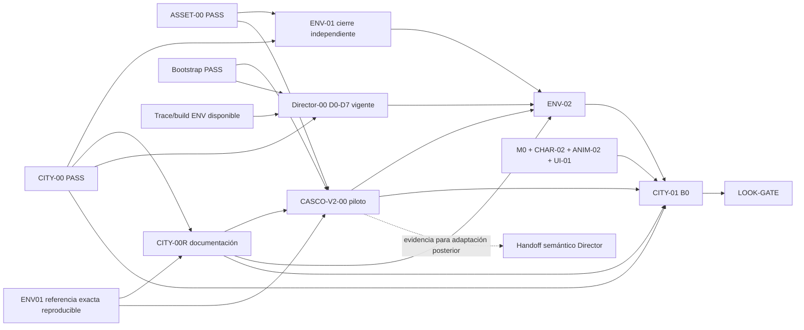

# Compact Semantic City — arquitectura propuesta

Status: **ARCHITECTURE CANDIDATE / INDEPENDENT REVIEW PENDING**
Date: 2026-09-30
Owns: escala urbana, unidad semántica y espacio deliberado.
Contracts: [`WP-CITY-URBAN-00R`](../workpacks/WP-CITY-URBAN-00R.md), después [`WP-PROD-ENV-CASCO-V2-00`](../workpacks/WP-PROD-ENV-CASCO-V2-00.md).

La decisión de dirección viene del Owner en este encargo. Los límites y pruebas numéricas adicionales de este documento son la propuesta del Arquitecto para revisión; no se presentan como mediciones de una ciudad V2 ni como aceptación ya emitida. Al aceptar CITY-00R se congelan como presupuesto inicial; el piloto valida su realización local, no la ciudad entera.

## Causa y corrección

ENV01 es una referencia visual valiosa. Su spec de CASCO contiene 311 plots construibles dentro de un marco de 196 × 236 m; los frentes tienen mediana 6,756 m y los fondos son 4/6/8 m. `EnvDistrict.BuildRows` convierte cada plot en un `BuildingSpec` y llama a `BuildingAssembler.Build`. Identidad comercial, masa, cubierta y eventual interior se deciden alrededor de esa unidad. El interior de tienda disponible es una plantilla de 4 m de fondo; el vidrio también puede mostrar habitaciones simuladas.

Esto hace barato producir grano histórico, pero no demuestra propiedades jugables, circulación interna o utilidad del vacío entre filas. El `VALIDATION.json` versionado de ENV01 declara 370 umbrales cerrados y **0 abiertos transitables** en CASCO. Las sondas de calle exitosas no prueban interiores. La cifra rectangular `frente × fondo` tampoco es superficie útil: hay que descontar muros, muebles, intersecciones y circulación real.

La corrección desacopla la unidad visual de la unidad funcional y diseña el interior desde actividad y ocupantes. No cambia la identidad atlántica, ni exige abrir todo, ni consiste en ensanchar todas las casas. Agregar IDs sobre los mismos cubículos tampoco corrige la causa: deben desaparecer las particiones/autoridades que impiden un programa mayor y verificarse su uso físico.

## Gramática congelada

**`FacadeCell != SemanticBuilding != InteriorProgramme`**

| Concepto | Responsabilidad | No implica |
| --- | --- | --- |
| FacadeCell | cuerpo/frente visual con ritmo, material, cornisa, cubierta y memoria constructiva; puede envolver una esquina o ser una trasera | propiedad, negocio, acceso o planta jugable independientes |
| SemanticBuilding | unidad funcional coherente con identidad estable, usos/ocupantes previstos, huella/volumen, accesos y límites | un solo frente, una sola actividad o accesibilidad universal |
| InteriorProgramme | actividades, usuarios, habitaciones útiles, relaciones, circulación, privacidad, servicio y plantas efectivamente jugables | plantilla automática inferida del ancho, número de ventanas o plantas exteriores |

Cada FacadeCell pertenece a **un** SemanticBuilding. Cada edificio tiene una o más células; 2–4 es una orientación frecuente, no una regla de reparto. Una célula no se duplica en dos propiedades para cerrar un contador. Un edificio mixto puede tener comercio abajo y viviendas arriba, y varios accesos legítimos, sin convertirse por ello en varias unidades contadas. Separar edificios exige límites espaciales y funcionales defendibles, no cambiar el nombre de una puerta.

Todo edificio, abierto o cerrado, registra: ID, identidad/uso concreto, relación con personas/actividad, células asociadas, huella y alturas, accesos/clases, profundidad, disponibilidad actual y razón de cierre cuando corresponda. «Filler residencial» repetido sin función/ocupación plausible no es identidad. No se exige escribir biografías o rutinas finales.

Todo interior accesible registra primero su programa: quién usa qué, por qué entra el jugador, superficie útil necesaria, estancia y giro de cámara, relaciones de habitaciones, recorrido público/privado/servicio y conexión vertical. Después se compone geometría. Un threshold breve sigue siendo válido cuando su tarea cabe; no es el tamaño universal de tienda/vivienda/local social.

Las plantas exteriores describen masa e historia; las jugables describen recorridos y actividades. Pueden diferir. Se documenta su correspondencia por sección, sin exigir que cada ventana tenga habitación, sin prometer escaleras a plantas inexistentes ni colocar habitaciones simuladas en un acceso declarado jugable. La identidad semántica es de autoría: no introduce una segunda autoridad de interacción, navegación o persistencia junto a GC2.

Ejemplo válido de diseño: tres frentes históricos contiguos forman un edificio mixto; comercio/sala de clientes y almacén detrás, entrada residencial distinta, escalera y vivienda arriba. Las células conservan revocos/aleros diferentes; desaparecen medianeras que bloquearían la sala común; programa y accesos definen una huella coherente. Dos plantas son jugables aunque alguna célula muestre tres plantas exteriores. Es un ejemplo de contrato, todavía sin prueba Unity.

Ejemplo inválido: las mismas tres cajas independientes con fondos de 4 m reciben un padre «edificio mixto», pero mantienen paredes/colliders interiores, puertas incoherentes y el hueco trasero sin uso. Tres escaparates de habitación simulada no son tres estancias accesibles. El contador bajó, la utilidad espacial no cambió: FAIL.

## Escala y presupuesto inicial

Una ciudad continua, compacta y trabajada; cinco **identidades** con fronteras blandas y tamaños muy desiguales. No son cinco encargos de distrito ENV01 ni cinco mapas/poblaciones aislados. La organización técnica de escenas queda abierta; no habilita streaming nuevo.

| Medida | Dirección / límite al aceptar CITY-00R | Cómo se comprueba |
| --- | --- | --- |
| Edificios semánticos ciudad | orientación 90–130; presupuesto inicial máximo 130, sin mínimo obligatorio | suma de identidades únicas; incluir cerrados y todos los edificios urbanos de fondo integrados en la ciudad |
| Edificios CASCO | orientación 30–40; presupuesto inicial máximo 40, sin mínimo obligatorio | misma unidad de conteo; no contar FacadeCells como propiedades |
| Diferencia de tamaños | zona funcional mayor ≥2 veces la menor por área de tejido urbano asignado | áreas netas de zonas; transiciones se asignan una vez y pueden tener etiquetas de ambos usos |
| Envolvente urbana total | ≤70.000 m² en planta, aproximadamente 1,5 veces el marco actual de CASCO | polígono que encierra tejido y espacios urbanos, incluidos patios cerrados, calles, ribera y vacíos interiores; no suma sólo huellas |
| Red pública de ciudad | ≤1.800 m de ejes únicos, contando alternativos, plazas atravesadas y escaleras | cada conexión física una vez; no duplicar por sentido ni excluir calle «secundaria» |
| Compacidad entre destinos | vecinos funcionales ≤180 m por ruta pública; extremo más distante entre destinos ≤700 m | distancias sobre grafo conectado, con anclas de las cinco identidades; caminata estimada a 3 m/s ≤4 min, a medir después en GC2 |
| Identidad y uso | 100% de SemanticBuildings | ledger por edificio, incluidas fachadas cerradas |
| Espacio exterior deliberado | 100% del ámbito urbano particionado; 0 zonas residuales sin resolución | mapa de suelo + prueba funcional descrita abajo |
| Interiores profundos | minoría: ≤20% de edificios de ciudad en el presupuesto inicial | programa multiespacio/vertical útil para misión o exploración; no reclasificar un pasillo como «shallow» para ocultar profundidad |
| Accesibilidad | sin porcentaje mínimo ni obligación del 100% | cada apertura demuestra necesidad; cierre honesto y uso siguen siendo válidos |

Estos topes impiden escalar por comodidad del generador. Estar bajo ellos **no basta** para PASS. Se permite una ciudad menor, menos edificios o menos profundidad si satisface los usos. Rebasar un tope requiere una enmienda explícita del Owner con causa y presupuesto nuevo antes de producir amplitud; no se cumple una cifra rellenando casas o recortando etiquetas. Los tamaños muy desiguales se expresan en área y programa, no sólo renombrando cinco zonas iguales.

La envolvente excluye mar abierto y paisaje distante ajeno al tejido urbano; un patio sin acceso, una franja decorativa entre casas o edificios visitables «scenic» siguen dentro del presupuesto. La continuidad no obliga a que las cinco identidades compartan la misma densidad.

### Hipótesis global suficiente para comprobar viabilidad

No es un plano final ni cuota por distrito. Es un presupuesto de trabajo, reemplazable dentro de los límites con razón:

| Identidad | Edificios orientativos | Área urbana orientativa | Programa dominante preservado |
| --- | ---: | ---: | --- |
| CASCO | 35 | 18.000 m² | mezcla cívica/doméstica, plaza/ribera, nightlife principal acotada |
| MERCADO | 25 | 14.000 m² | compras recurrentes, cafés, comercio, pensión/B0 |
| MUELLE | 15 | 12.000 m² | lonja, almacenes, trabajo/turnos y borde público controlado |
| TALLERES | 10 | 7.000 m² | reparación/servicio, nightlife alternativa menor |
| VIVIENDAS | 20 | 9.000 m² | hogar y contraste tranquilo, tejido en pendiente |
| Total de hipótesis | 105 | 60.000 m² | una ciudad, con suelo de transición asignado sin doble conteo |

Un esquema de viabilidad puede ocupar un marco **300 × 200 m**, con sur junto al puerto. No son coordenadas shipping ni una exigencia de reconstruir allí ENV01:

| Zona | Región esquemática `(x,z)` en metros | Ancla funcional propuesta |
| --- | --- | --- |
| CASCO | x=0–150, z=80–200 | (105,150), viejo tejido elevado |
| VIVIENDAS | x=150–300, z=140–200 | (185,165), residencial alto |
| TALLERES | x=230–300, z=40–140 | (255,105), servicio hacia puerto |
| MUELLE | x=0–300, z=0–40 | (175,20), trabajo y borde público |
| MERCADO | resto conectado: x=0–150,z=40–80 + x=150–230,z=40–140 | (180,90), B0 hacia el borde sur |

Estas regiones particionan 60.000 m², sin solape ni vacío, y tienen todas las adyacencias U01/U03–U07; U02 ocupa una segunda conexión pública Mercado–Muelle. Son envolventes de **usos**, con transición blanda: ni rectángulos de edificios ni una gramática de calles ortogonales. El río pequeño puede seguir el borde occidental de CASCO/Mercado al puerto; las conexiones exigidas quedan en tierra. Puerto controlado está del lado de trabajo y sus límites no interrumpen el borde público B0. B0 conserva sus anclas/ambos ciclos dentro de Mercado/borde Muelle, con distancias originales abiertas a compresión; no se escala todo para conservar el diagrama antiguo.

Viabilidad topológica indicativa, con longitudes **propuestas, no medidas**: U01 100 m, U02 150 m, U03 120 m, U04 100 m, U05 100 m, U06 140 m, U07 120 m; total de relaciones 830 m y reserva de red local 970 m. Cada longitud puede acomodar la separación de las anclas y su cruce de borde en el esquema. El mayor camino mínimo entre estas cinco anclas es 220 m. Los extremos locales consumen la reserva y conservan el máximo global de 700 m. U08 queda opcional y, si se admite después, consume presupuesto. El esquema prueba compatibilidad de límites y roles a fidelidad de planificación; pendientes, fachada/interior y recorrido real siguen pendientes del piloto/realización.

La orientación de 2–4 células por edificio no permite convertir mecánicamente 311 plots en 35 edificios: daría ~9 plots por edificio y conservaría todo el tamaño heredado. Tras el piloto, una futura reducción de CASCO seleccionará/absorberá tejido, evitando extrapolar 311 × cinco. **Esta arquitectura no autoriza esa conversión completa.**

## Ningún espacio sobrante

Cada porción exterior dentro del ámbito debe tener función y dueño espacial: calle, paso, plaza, patio, jardín, terraza, servicio, carga, ribera, desnivel/retención o retranqueo funcional. El plano cubre suelo entre edificios, traseras, cuñas de esquina, taludes y bolsillos detrás de decoración. Los interiores de edificios se contabilizan por programa, no se esconden en el mapa exterior.

Para cada espacio se identifica: límites, función, usuarios, acceso o razón de no acceso, soporte físico y relación con edificios/calle. Un patio necesita entrada plausible y capacidad de su uso; carga necesita llegada y maniobra; jardín necesita vínculo y mantenimiento plausible; un desnivel necesita resolver una diferencia real y su borde; una terraza necesita relación con el local y no obstruir circulación. Rotular un hueco «servicio» o plantar arbustos no demuestra intención.

Un vacío sin función se absorbe en masa/programa, une a un espacio útil o rediseña. No se rellena todo: quietud, separación privada y vistas pueden ser razones explícitas, proporcionadas y comprobables. Quietud no necesita misión/prop interactivo por metro cuadrado; tampoco justifica una franja aleatoria inaccesible entre filas.

Prueba: overlay de partición sin huecos/solapes sustantivos, secciones donde hay relieve, recorrido de todos los bordes y contraste de etiquetas con los accesos físicos. Descartar superficies diminutas sólo por tolerancia geométrica documentada (≤0,01 m² de redondeo); cualquier bolsillo físico visible/usable se resuelve, sea cual sea su área.

## Decisiones que se preservan y que se reabren

| Preservar | Razón / frontera |
| --- | --- |
| norte de España ficticio, época, puerto de trabajo, low-poly/PS2+, identidad atlántica | dirección del juego no cuestionada; nombres finales siguen abiertos |
| CASCO lebaniego/Potes como alma morfológica y visual | calles irregulares, materiales, teja/aleros, solanas selectivas, historia; no calco ni nombres reales |
| cinco usos y nightlife CASCO principal / TALLERES secundaria | identidades funcionales, sin áreas equivalentes |
| U01–U07, U08 opcional, ciclos y viajes sin hub universal | la compacidad cambia longitud/implantación, no significado o acceso |
| B0 Mercado–Muelle y L/A/S/E/P/Q/O/V | sigue siendo primer bloque de integración keeper; piloto CASCO es experimento previo, no sustituto |
| río pequeño de borde, puentes, descenso al puerto, ciudad que asciende | perfil/relieve útil; piloto conserva calles y cotas de borde |
| ~70/20/10 cómodo/perceptible/fuerte por longitud | intención de terreno; no exigir esa proporción a una sola manzana |
| ritmo estrecho y variable de fachadas, cubiertas y huecos; hitos/vistas | FacadeCells conservan carácter aunque pertenezcan al mismo edificio |
| catálogo/derivados/linaje, materiales, gramática visual, probes, GC2, trabajo útil del Director | reutilizar y corregir sólo el límite causal encontrado |
| calle pública vs servicio/privado, puerto público vs trabajo controlado | agregar edificios no crea atajos privados gratuitos |

| Reabrir exclusivamente | Nueva decisión |
| --- | --- |
| «large town» como área construida y cinco distritos ENV01 equivalentes | una ciudad compacta; presupuesto global y reparto muy desigual |
| plot/fachada = edificio = negocio/interior | mapeo explícito muchos-a-uno; usos mixtos y programa propio |
| fondos/planta interior derivados del módulo de cubierta | programa fija espacio; cubierta y cuerpos visuales se adaptan |
| plantas exteriores = plantas jugables | correspondencia explícita, accesibilidad selectiva |
| gaps/back-to-back/decoración como resolución automática de suelo | 100% de intención; absorción/rediseño cuando no hay función |
| extrapolación de densidad CASCO y destino de todos sus plots | sólo piloto ahora; reducción futura selectiva con evidencia |
| escalar ENV antes de probar edificios útiles | CITY-00R → piloto → ENV-02 → B0, con Director en paralelo |

No se reabren NPC tiers/población, investigación, combate, rutinas, B0 loops, adquisiciones ni arquitectura GC2. No se declara aceptado ENV01 por gusto visual ni se revoca su trabajo útil por cambiar el presupuesto futuro.

## Dependencias anteriores y nuevas

Grafo anterior **de contratos actuales en main** (la base inicial de ENV01 todavía mostraba ENV-02 sólo tras ENV-01):

No hay arista ENV01 PASS → Director: el Director consume su sustrato activo, según su contrato, aunque el dibujo previo del índice parecía una cadena.

Aristas continuas = requisitos de aceptación o inputs exactos según etiqueta; discontinua = información, no WP adicional ni dependencia de ejecución del piloto. CITY-00R es documental y puede aceptarse con ENV01 aún abierto. El piloto consume un snapshot reconstruible, **no ENV01 PASS**. ENV-02 conserva ENV01 PASS y Director PASS y añade CITY-00R/piloto PASS. No existe ENV02/Director/CITY01 → piloto.

D0/D1 y su reparación transaccional mantienen contrato y revisión propios. Pueden avanzar en paralelo sobre ENV01 sin reinicio ni conversión semántica especulativa. Las funciones genéricas D2–D7 siguen útiles; toda operación que necesite decidir qué es un edificio/interior V2 espera la evidencia del piloto. Director puede seguir probándose en la referencia legacy sin afirmar que esa escala es el diseño final. Ni el piloto sustituye sus pruebas de UX, ni el Director decide el programa urbano.

ENV01 se puede cerrar bajo su claim de fábrica/referencia actual; el piloto no se añade retroactivamente como gate. Su PASS tampoco convierte CASCO de 311 cuerpos en parcelario final aprobado. Los futuros resultados aplican esta enmienda una vez CITY-00R sea aceptado.

## Handoff posterior al Director, sin implementación autorizada aquí

| Capacidad probable | Pregunta que debe resolver el piloto antes de especificarla |
| --- | --- |
| merge semantic building | cómo unir huellas/células contiguas sin colisión/particiones internas, preservando accesos/IDs/locks |
| assign programme | campos útiles realmente usados por comercio, vivienda y social; usos mixtos y cambios de acceso |
| playable floors | correspondencia de plantas visuales/jugables, niveles y continuidad vertical |
| edit access / service / courtyard | clase de puerta, llegada exterior y uso real de trasera; no crear shortcut |
| select building vs FacadeCell | selección/locks al nivel correcto sin confundir material visual con propiedad |
| compare / validate affected programme | vistas idénticas, ocupación/cámara, espacio residual y persistencia tras reconstruir |

El piloto entrega operaciones realizadas, fricción, ejemplos y datos mínimos, con `USE / ADAPT / DEFER / REJECT`. No implementa botones, un schema universal, un generador de interiores ni una revisión total del Director. Si el siguiente Worker necesita adaptar una operación semántica, lo hará con evidencia y un alcance posterior explícito; ENV-02 puede reutilizar ensamblajes admitidos sin exigir que todas estas capacidades existan.
