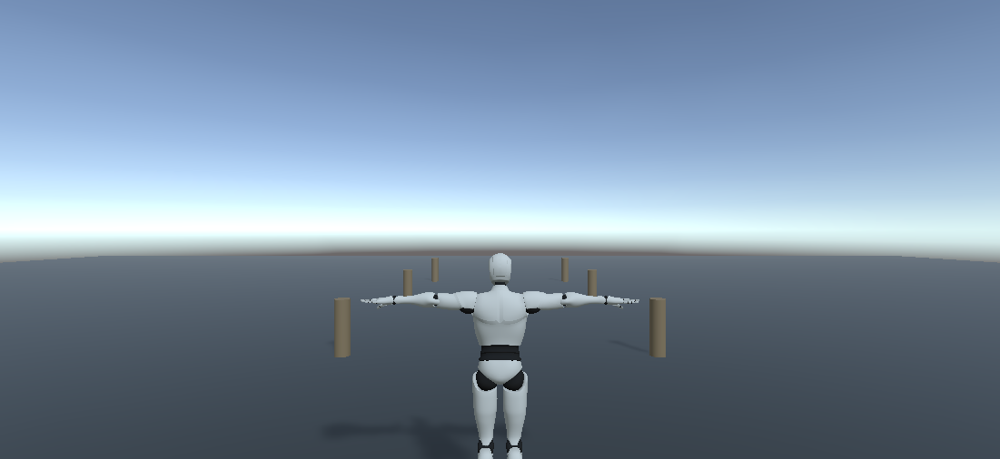
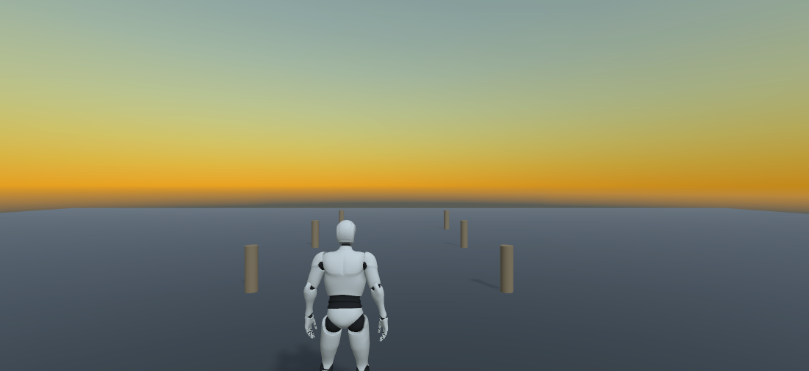
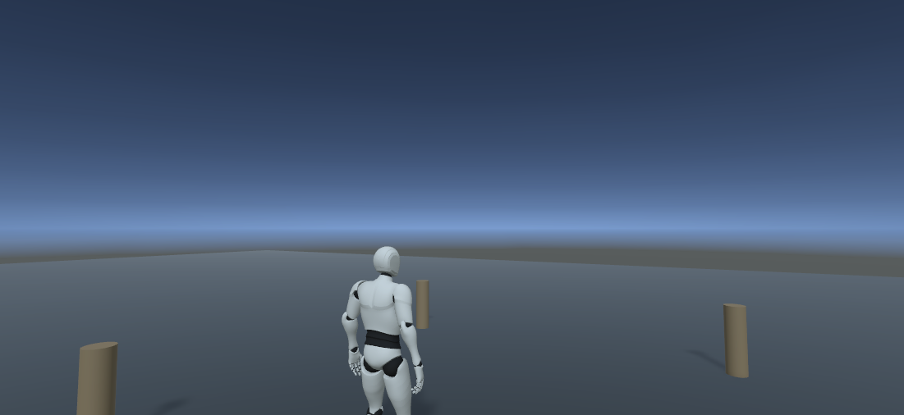
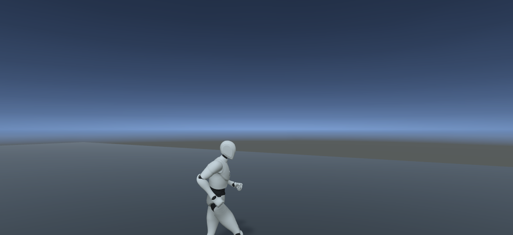

# Bootstrap Unity + GC2 Core — evidence

Date: 2026-09-28 · Roadmap steps: **Bootstrap Unity** + **GC2 Core** · Operator: Claude Code + MCP for Unity v10.2.0 (Unity-side package) / server 10.2.x

## Result

| Roadmap PASS | Result | Evidence |
|---|---|---|
| Project opens, scene plays, versions/pipeline recorded | **PASS** | Unity 6000.3.24f1; batch import + windowed open with 0 compile errors; URP active (`JD_URP`); `Bootstrap_GC2Core` enters/exits Play Mode repeatedly |
| Walk, turn and follow in Play Mode (GC2 Core player + camera) | **PASS by operator; keyboard feel pending owner check** | see runtime checks below |

GC2 Core provisioned with `Tools/gc2-provision.py install` → `GC2_INSTALLED version=2.19.61 imported=3630 excluded=['Packages/manifest.json']`. Compiled assemblies: `GameCreator.Runtime.Core`, `GameCreator.Editor.Core`, `GameCreator.Tests.Core`, `MCPForUnity.Runtime`, `MCPForUnity.Editor`.

## Scene built by the operator

`Assets/JuegoDef/Scenes/Bootstrap_GC2Core.unity` — a technical bootstrap scene, **not** the M0 street:

- `Player` — created through GC2's own menu *GameObject/Game Creator/Characters/Player* (GC2 Mannequin, `CompleteLocomotion` controller, valid Humanoid avatar);
- `Main Camera` (GC2 `MainCamera`, URP post-processing on, FOV 55, near 0.05) + `Camera Shot` set to **Third Person** with the owner-approved Juego2 S06 values (radius 3, shoulder 0.5, lift 1.0, pivot = Player);
- `Ground` 60×60 m (URP/Lit damp grey), `Reference_Bollards` ×6 as spatial markers for turning/follow;
- `Sun` directional (0.83/0.89/0.93, 0.9, soft shadows, 43°/−28°), trilight ambient, exponential² fog 0.012, placeholder procedural sky.

| Edit mode | Play: idle | Play: walk forward | Play: turning |
|---|---|---|---|
|  |  |  |  |

## Runtime checks (Play Mode, via operator)

| Check | Observation |
|---|---|
| Initialization | `ShortcutPlayer.Instance` set, motion unit bound to the Character, `Driver.IsGrounded = true` at y = 1.08 |
| Walk | `Motion.MoveToLocation((0,0,10))` → Player z 0 → 9.82 (stop distance 0.2), facing +Z; camera followed (z −2.35 → 7.47), distance 3.15 m |
| Turn | `MoveToLocation((8,0,16))` → yaw 52.3° (expected ≈ 52°), locomotion `Speed-Z = 1.0`, camera distance constant 3.15 m |
| Console | no GC2/project errors; only `NoSubscription` errors from the optional Unity AI Assistant package |

GC2's player input unit issues its moves at priority 0; the test used priority 1, so scripted moves overrode input without fighting it.

## Operator log — failures and corrections

Lightweight version of the intervention accounting in `PRODUCTION_AUTHORING_DECISION.md`, kept to judge the operator honestly.

| # | Issue | Diagnosis | Correction |
|---|---|---|---|
| 1 | `manage_material create` failed | target folder `Materials/` did not exist | created folder, retried — OK |
| 2 | Light `color` rejected | tool expects `{r,g,b,a}` object, not array | resent as object — OK |
| 3 | `is_static` ignored on `manage_gameobject create` | tool defect (returned `isStatic=false`) | set static flags via `execute_code` |
| 4 | Screenshot to external folder refused | output must be inside the project | `Captures/` (ignored) + copy to `Docs/evidence` |
| 5 | `execute_code` compile errors | CodeDom C# 6: ambiguous `Object`, unqualified `EditorSceneManager` | fully qualified names |
| 6 | Shot type could not be set with generic tools | GC2 uses `[SerializeReference]` | `SerializedObject.managedReferenceValue` in `execute_code` |
| 7 | Sky showed an orange sunset band | procedural sky atmosphere too thick | retuned; sky remains a placeholder (ENV work) |
| 8 | Player "not initialized" / `MoveToLocation` NRE | `Time.time` did not advance between calls: Editor froze the player loop while unfocused (`runInBackground = false`) | `PlayerSettings.runInBackground = true`; re-ran Play — OK |
| 9 | Simulated `W` key had no effect | Input System keeps disabling the keyboard while the Editor is unfocused | **unresolved** → owner manual check |
| 10 | Tool calls timed out mid-run | owner installed packages (AI Assistant/Inference) → domain reload | waited for Editor `ready`; no damage |

Counts: owner manual clicks for building the scene **0**; exact-path hints **0**; rescue scripts **0** (one one-shot batch script configured URP and was deleted); `execute_code` escape hatch used for GC2 managed references, scene save/build settings, runtime probes and motion checks.

Assessment: the operator handled GC2 wiring, lighting, materials, Play Mode and visual readback end to end and diagnosed its own failures (#8 in particular required reasoning from runtime evidence, not a tool error). Weak spots: generic tools do not cover GC2's polymorphic fields, and real input can't be exercised while the Editor is in the background.

## Residuals

- **Owner check (≈30 s):** press Play in `Bootstrap_GC2Core`, walk with WASD, orbit with the mouse.
- GC2 default speed (~4 m/s) is a jog; tune a walking pace for the Shenmue-like street in M0.
- Mannequin, bollards and the procedural sky are placeholders; they carry no art approval.
- Optional Unity AI packages add console noise without a subscription (see `UNITY_PROJECT_SETUP.md`).
