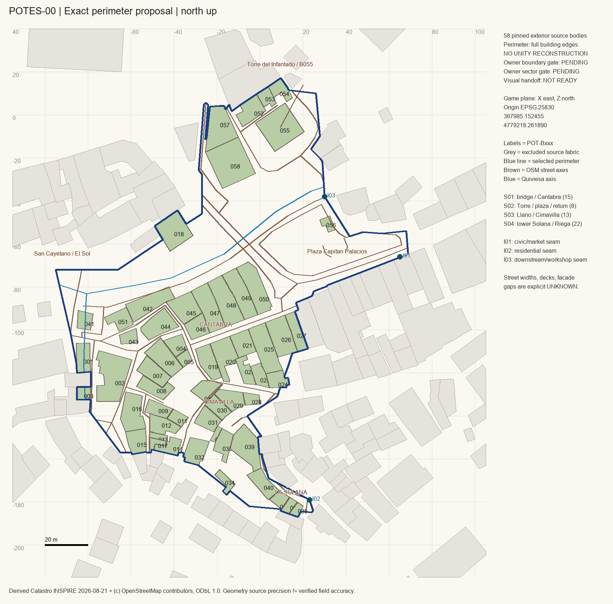

# Primary exact cut — Owner review proposal

Status: **PERIMETER PROPOSAL / OWNER GATE PENDING / VISUAL HANDOFF NOT READY**.
The only proposed place is the Owner's Torre/plaza → Cántabra/Cimavilla → western
La Solana → San Cayetano/El Sol → Cervantes/Torre connected return.

Use [`potes_core.geojson`](potes_core.geojson) for the exact EPSG:25830 polygon,
[`buildings.geojson`](buildings.geojson) for complete body geometries and
[`maps/pnoa_perimeter_overlay.jpg`](maps/pnoa_perimeter_overlay.jpg) for the aerial
cross-check. The polygon is an exact proposed study cut, not a surveyed municipal
district boundary. No alternate town or competing district is proposed.

| Measure | Pinned result / interpretation |
| --- | --- |
| Exterior footprint count | **58 unchanged exterior source surfaces**, `POT-B001`…`POT-B058`; cadastral/OSM/aerial cross-checks retained per body |
| Area | **14,886.5817 m²** / **1.488658 ha** |
| Bounding dimensions | **163.9036 × 204.1890 m** |
| Bounding box, EPSG:25830 | E **367890.152455…368054.056066**; N **4779031.111500…4779235.300500** |
| Coordinate transform | X=E−**367985.1524553847**; Z=N−**4779218.261889531**; metres, east/north, no scale or rotation |
| Walking-axis union | **1,026.1549 m**; excludes the plaza outline as a walking circuit and river centreline |
| Meaningful longest shortest path in main source component | **367.7738 m**; downhill riverwalk interface to northern Cervantes return boundary |
| Traversal estimate | **3.405 min at 1.8 m/s**; **4.378 min at 1.4 m/s**, without pauses. No Unity/runtime claim. |
| Broad terrain context | Walking-axis MDT samples **280.000…307.157 m**; **not surveyed street/deck levels** |
| Parcels | **63** intersected / **53** whole cadastral source parcel polygons; do not call this 63 buildings |
| Blocks | **3 closed centreline faces** are reproducible; exact urban-block count remains `UNKNOWN` because source axes include open boundaries/passage components. Not equivalent to the earlier study's 25 authored/reference faces. |
| Footprint min / median / max | **18.101 / 88.9526 / 321.2654 m²** |
| >100 / >200 / >400 m² | **22 / 4 / 0** |
| Production sectors | **4**, containing **15 / 8 / 13 / 22** bodies |

Exact values and methods are in [`METRICS.json`](METRICS.json), the ledgers and
`Tools/potes_reference.py`. The small reported source accuracy is not independently
verified field accuracy. Source network has **11 graph components**; most are clipped
stubs, passages or public-area axes. One connected polygon does not prove all OSM
components are joined or that all physical routes have been surveyed. Do not bridge
graph gaps with invented shortcuts.

## Boundary reasoning

Start from the previously studied core, then move **only the outside** to the
complete source edges. The whole selected public plaza is retained. The western
seam includes San Cayetano bridge and its El Sol approach; the northern node retains
the Infantado tower and its attached/contextual frontage; the southern seam follows
the western Solana passage and Fuente de la Riega/Llano edge. The east edge stops
before the extended Obispo/San Pedro/eastern Solana fabric.

The initial outer vertices, fixed transform, whole-edge procedure and named return
axis guard are in [`reference_decisions.json`](reference_decisions.json). The narrow
return guard is a **boundary control**, not an invented street-width measurement.
The final exact polygon is the GIS artifact, not the initial sketch.

Every selected source footprint retains all coordinates/holes. `MEMBERSHIP_AUDIT.json`
audits **all 205 nearby source surfaces**, not just selected bodies. No interior
footprint is omitted. Multiple surfaces on a cadastral reference receive separate
physical-body IDs; **building parts/floors do not receive new IDs**. No unions,
splits, scaling or procedural replacements are used to hit the count.

A source ambiguity at `8193301UN6789S` has a recent **declined 6 m²** footprint and
an old photograph showing a much larger frontage, overlapping two older OSM bodies.
The final outer seam leaves that eastern frontage and adjacent row outside. The
conflicting record is retained in the context audit; it is not silently used as an
invented narrow building or removed from the selected interior.

The legacy **145** value is a broader OSM study, using another source epoch and
approximate local frame. It is not a cadastral identity census. The reduction here
is a smaller **outer cut** of unchanged real-source bodies. Do not subtract 58 from
145 and call the difference a verified demolition/exclusion register.

## Places and relationships retained

- **Infantado tower**: `POT-B055`, source `8194106UN6789S`, corroborated by OSM
  way `568551490`. Torre foreground/return frontage: B052–B054, B057–B058.
- **Plaza Capitán Palacios**: `POT-P-OSM329379237`; source polygon retained whole.
  B056 is a real small river/plaza-side built element, not a substitute tower.
- **Cántabra**: OSM `27801324`, northern real frontage B045–B050 and opposing
  B019–B027. The east continuation is deliberately outside the selected cut.
- **Cimavilla and western La Solana**: real passages/stairs and ordinary attached
  bodies; no widened alleys or flattened terrain. The main eastern/southern Solana
  extension is outside the perimeter.
- **San Cayetano**: `POT-BR-OSM160490852`, B041 bridge shop, varied attached frontage,
  B018 at the El Sol approach. The larger road bridge also crosses the Quiviesa
  inside the chosen node: `POT-BR-OSM27801328`.
- **Additional breathing space**: visible widening at the Llano / Fuente de la
  Riega junction beside B008/B009/B016. Its exact public-space polygon/edge remains
  `UNKNOWN`; no fictitious plaza is substituted.

## Three outward interfaces

These are real seams, not permission to build later expansion zones.

| Interface | Local point (X,Z), m | Existing link / future purpose |
| --- | --- | --- |
| I01 | **(65,−66)** | Doctor Encinas / plaza continuation, credible later civic/market connection. |
| I02 | **(23,−179)** | Western La Solana continuation, credible residential expansion. |
| I03 | **(30,−38)** | Lower riverside walk / downstream connection towards Deva; future workshops/port transition can be planned separately. This does not claim a real port in Potes. |

Excluded: extended Obispo/San Pedro east, deeper eastern/southern La Solana,
extended El Sol/Serna west, San Vicente churches, broad north civic/modern fabric,
Campo/Tullo beyond the outer residential seam and later market/port areas.

## Reconstruction burden / surviving blockers

58 exteriors include irregular corners, adjoining roof/floor parts, galleries,
multiple above/below-ground levels and two river crossings. The 14-body First Slice
tests those classes. It is not a batch of interchangeable 2 m facade bays.

The geometry census is reproducible, but **Sector Pack 01 is not yet sufficient for
faithful physical production**: partial/occluded facade coverage, missing numerical
opening/ridge transcription and bridge/threshold/stair controls survive. See
[`sector-01/SECTOR_PACK.md`](sector-01/SECTOR_PACK.md). No claim of independent PASS
or permission to begin Unity follows from this proposal.
