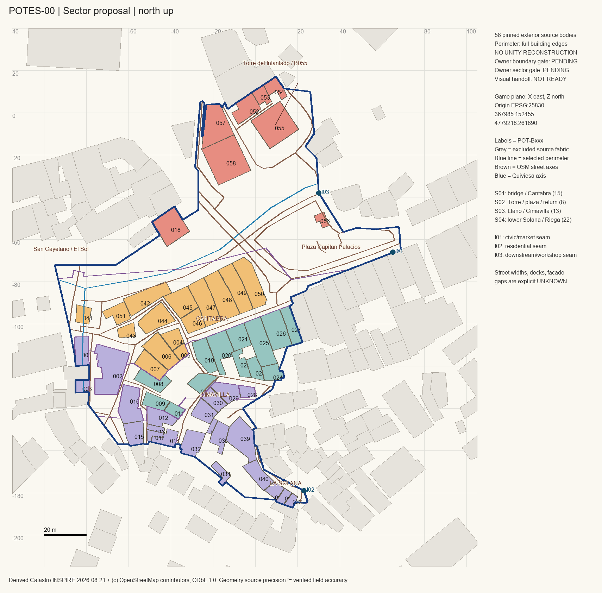

# Four production sectors — Owner review proposal

Status: **SECTORIZATION GATE PENDING**. Sectors are production batches only.
Exact polygons, members, public-space IDs, neighbours and shared-wall/roof candidates
are in [`SECTORS.json`](SECTORS.json) and [`sectors.geojson`](sectors.geojson).

| Sector | Bodies | Rationale / complexity |
| --- | ---: | --- |
| **POT-S01** — San Cayetano / Cántabra junction | **15** | Two bank/bridge levels, low stone shop, compound river-facing galleries, narrow commercial fronts, irregular Llano corner. High complexity; chosen to falsify facade/roof/level method. |
| **POT-S02** — Torre / plaza / El Sol return | **8** | Infantado landmark, attached foreground, river/plaza element, Cervantes return and El Sol approach. High landmark/river/step complexity. |
| **POT-S03** — Llano / Cimavilla upper frontage | **13** | Opposing attached fronts, gallery/canopy ownership, rear patio and narrow source parts. High seam/roof dependency. |
| **POT-S04** — western Solana / Fuente de la Riega | **22** | Vertical irregular passages, annex/shed surfaces, source parts on both sides of changes in level. High circulation/retaining/threshold complexity. |

All 58 members are owned exactly once. The transform is shared, not independently
recentered by sector. Body polygons are not split by a production cut. Some sector
geometry includes small source-edge tolerance slivers; see validation, rather than
interpreting them as in-world district borders.

## Exact membership

- S01: **B004–B007, B041–B051**.
- S02: **B018, B052–B058**.
- S03: **B008–B011, B019–B027**.
- S04: **B001–B003, B012–B017, B028–B040**.

All abbreviations mean `POT-Bxxx`. Membership lists in JSON are the machine authority.

## Natural seams and dependency rules

The river/bridge/plaza approach separates S01/S02 public surfaces; Cántabra's real
frontage separates S01/S03. Llano/Cimavilla's irregular mouths and Fonte de la Riega
break separate the upper frontage from S04. The whole Llano corner B007 is retained
in S01 to avoid splitting a single physical building; its party/roof dependency on
B008 is explicit.

Every derived shared-wall candidate across a boundary, including excluded source
neighbours, is retained in `party_wall_roof_dependencies`. **Coincident plan edges
do not prove a common roof or wall height.** Roof dependencies remain UNKNOWN until
traced. A later Worker must not fill such edges with exposed-window facades or
remove an adjoining context building to make the sector look complete.

Cross-boundary views to preserve:

- S01 bridge ↔ B018 / El Sol ↔ both river banks.
- S01 eastern street end ↔ S02 plaza / Torre silhouette.
- S01 B004–B007 corner ↔ S03 B008–B011 / Llano widening.
- S01 commercial front ↔ opposing S03 B019–B027.
- S03 Cimavilla mouths ↔ S04 steps/passages and varied lower roofs.
- S04 peripheral view ↔ excluded eastern Solana frontage: record context, do not
  reconstruct that whole frontage inside the approved perimeter.

## Reference completeness

Source body geometry is pinned for every member; source building parts/addresses,
OSM checks and photo retrieval coverage are retained per building. Photo existence
is not complete facade coverage. **No sector is yet certified ready for faithful
physical production.** Exact road boundaries, bridge/step elevations, compound ridge
graphs and full opening coordinates survive as blockers. Owner's sector decision
selects the batches and Sector 01; it does not approve invented unknown facts.
