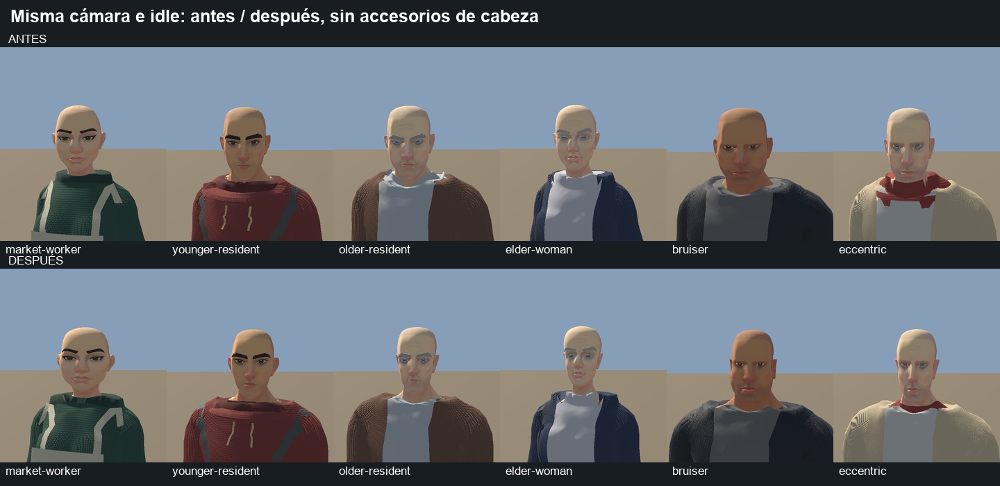
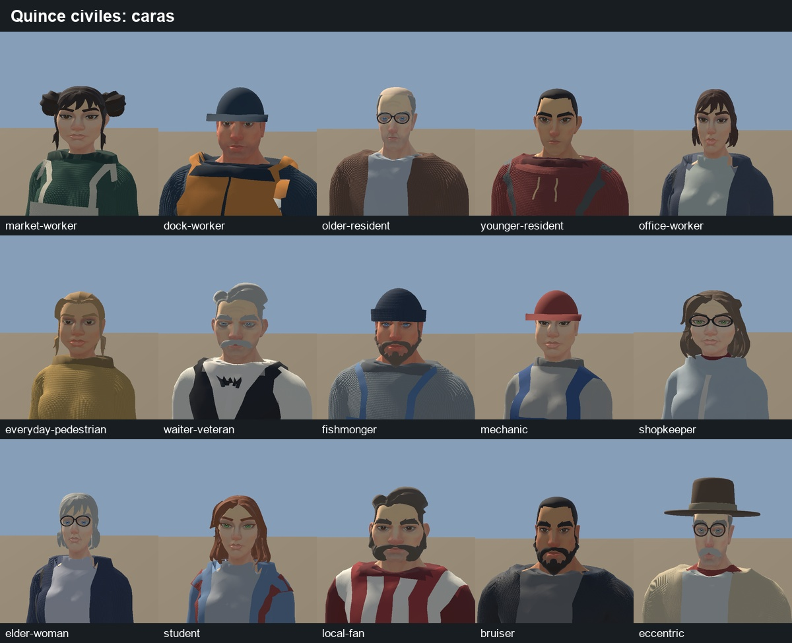

# Corrección de personajes — 30 de septiembre de 2026

Se han trabajado **los quince civiles de `characters-01`**, exclusivamente en CHAR. La intervención modifica la anatomía y presentación de los modelos, sus prefabs, materiales y herramientas de reconstrucción; no coloca NPC nuevos en ENV ni modifica escenario, iluminación, navegación o GC2. La entrega es una iteración local, sin merge ni aceptación visual independiente.

Proyecto abierto: `C:/Users/Usuario/.codex/worktrees/characters-01/Juego Def/Unity/JuegoDef`. Escena: `Assets/JuegoDef/Scenes/CHAR/CivilianFitPreview.unity`.

## Resultado y comparación

- Quince formas de cabeza definidas de forma intencionada: anchura y cráneo, mandíbula y mejillas, nariz/puente/anchura, boca, ojos, mentón, frente y asimetría. La transición al cuello es continua. Se comparan también sin pelo, barba, gafas y sombrero.
- Más variedad de masa corporal dentro de las proporciones admitidas: residente joven más estrecho, fan con más abdomen y profundidad, trabajadora de mercado más compacta, estibador más grande, portero con brazos/cuello más fuertes, excéntrico estrecho y ancianos con cuello más fino, curvatura y caída de mejillas.
- Manos menores y pulgar menos forzado; huesos y malla se escalan juntos. Hombros con menor rotación sostenida y brazos de reposo más bajos. Asimetría y encorvamiento diferentes por persona, aplicados sobre las animaciones existentes.
- Tres grados de holgura en la ropa, coordinados con capas exteriores y chalecos. Collares/bufandas con contorno medido, borde superior a 3 mm de la piel y más continuidad de piel bajo las aberturas. Raíces de pelo asentadas tras cambiar el cráneo. Normales recalculadas tras deformar.
- Piel con respuesta menos uniforme: variación vascular y de rugosidad, pecas, manchas de edad, lunar o pequeña cicatriz según receta. Conserva atlas/UV y pases de iluminación de URP. Cinco semillas de conversación reciben mayor detalle de presentación; esto no es todavía una jerarquía completa de LOD o personajes narrativos.
- El delantal largo necesitó una corrección adicional de pesos de muslo y holgura durante la marcha. Las faldas conservan su regla independiente; no se ha introducido simulación de tela.

Los retratos usan cámara a 1,35 m, FOV 28°, 560×650, misma fase del idle civil y SSAO desactivado para observar el asset. Las escenas de calle son una **fixture** de escala humana, no el escenario ENV. Las poses reales de cada receta se verifican por separado. Los originales PNG están en `Unity/JuegoDef/Captures/char`; aquí se retienen las hojas relevantes.

## Los treinta puntos: cobertura real

«Mejorado» significa intervención concreta y comprobación, no aprobación subjetiva definitiva. «Parcial» significa que queda una parte relevante.

| Punto | Estado | Intervención / límite |
|---|---|---|
| 1. Repetición de base | Mejorado | Quince perfiles anatómicos; siguen compartiendo tres familias de topología y un rig. |
| 2. Siluetas corporales | Mejorado | Altura, masa, anchura, abdomen, profundidad, cuello y brazos. |
| 3. Caras genéricas | Mejorado | Quince configuraciones de forma; no se han creado quince topologías nuevas. |
| 4. Identidad accesoria | Mejorado | Comparación sin accesorios de cabeza y rasgos intrínsecos. |
| 5. Edad anatómica | Mejorado | Cuello, curva corporal, mejillas y presentación; no todos los ancianos tienen la misma configuración. |
| 6. Cabezas similares | Mejorado | Cráneo, mandíbula, frente, proporciones de cara y ojos. |
| 7. Pelo añadido | Mejorado | Ajuste de raíces y deformación coherente con la cabeza; el diseño de mechones sigue siendo el de origen. |
| 8. Manos grandes | Mejorado | Reducción por perfil, especialmente el excéntrico; proporciones validadas. |
| 9. Dedos rígidos | Mejorado | Pulgar menos cerrado y tabla de dedos relajados; la actuación gestual completa sigue compartida. |
| 10. Cuello/cabeza | Mejorado | Transición continua, solape de piel y remates medidos; las sombras de ENV no se editan. |
| 11. Hombros rígidos | Mejorado | Menor componente sostenido de rotación y menor elevación de brazos de reposo. |
| 12. Codos separados | Parcial | Mejora en reposo/marcha; la gesticulación de conversación sigue siendo la animación de origen. |
| 13. Transferencia de peso | Parcial | Asimetría de tronco y postura, conservando dinámica/curvas de pies. No se ha creado una marcha físicamente nueva. |
| 14. Lenguaje corporal | Mejorado | Presentación por receta y tres variantes sobre las fuentes compartidas. |
| 15. Silueta de ropa | Mejorado | Holgado y capas por persona, combinado con la nueva masa corporal. |
| 16. Ropa sobre mismo cuerpo | Mejorado | Ajustada/normal/holgada; no es una reconstrucción completa de todos los patrones. |
| 17. Asimetría | Mejorado | Rasgos faciales y postura con desviaciones pequeñas, intencionadas y acotadas. |
| 18. Piel plana | Mejorado | Variación de superficie/complexión conservando compatibilidad URP. |
| 19. Identidad facial media distancia | Parcial | Más forma intrínseca; no se promete reconocer detalles faciales a 10–20 m o con pocos píxeles. |
| 20. Primer plano frente a ENV | Parcial | Mejor anatomía/remates/piel; faltan expresión facial, actuación y acabado de protagonistas. |
| 21. Proporciones muñeco | Mejorado | Límites de cabeza/mano/cuerpo conservados y comprobados en todo el lote. |
| 22. Extremos plausibles | Mejorado | 1,53–1,94 m; más corpulencia/delgadez dentro del sobre humano existente. |
| 23. Variedad por grupo | Mejorado | Diferenciación interna de hombres y mujeres; continúa la base estilizada compartida. |
| 24. Edad por clichés | Mejorado | Se mantienen accesorios, pero se añade anatomía y postura que funcionan sin ellos. |
| 25. Rasgos memorables | Mejorado | Portero de mandíbula fuerte/cara estrecha, excéntrico alargado, mercado redonda, ancianos distintos. |
| 26. Procedural evidente | Parcial | Perfiles autorados y composición menos homogénea; el origen modular aún puede percibirse. |
| 27. Limpieza excesiva | Mejorado | Asimetría y complejidad de piel sutil. Desgaste profundo/bespoke de toda la ropa queda pendiente. |
| 28. Jerarquía cerca/fondo | Parcial | Campo y respuesta visual de conversación; sin LOD, selección por distancia ni nueva población. |
| 29. Personaje importante | Parcial | Cinco semillas con prioridad de conversación; no son protagonistas con rig/expresión facial propios. |
| 30. Identidad estilística | Parcial | Mayor autoría de siluetas/rostros/presentación; la aceptación frente a ENV corresponde al Owner. |

## Validación y protección frente a regresiones

- Reconstrucción Blender **15/15**, un esqueleto de **65 huesos** por modelo, cero vértices sin pesos. Mismos fuentes/admisiones CC0; vendor Chilyer intacto.
- Rangos observados: **7,008–7,960 cabezas** de altura y manos/cabeza **0,717–0,800**. Los límites anteriores siguen activos; no se ampliaron para hacer pasar una deformación.
- **48 casos negativos** rechazados por receta/proporciones, incluyendo fit, tier, complexión y posturas imposibles.
- Barrido denso: **1.080 muestras** (15 × 3 movimientos × 24 fases), sin fallos de referencias, finitud, volumen o suelo. **1.575 curvas** de root, piernas y pies comparadas a 64 puntos: preservadas respecto a la fuente civil correspondiente.
- Play Mode: **180 muestras** y **36 hojas de ajuste** (frente/lateral/espalda, cuatro fases, tres movimientos). **24 hojas de distancia** a 10/20 m, tres orientaciones, color/silueta y dos resoluciones. Cada hoja de distancia contiene tres cámaras separadas de cinco personas, evitando que una ampliación de seis a quince deje gente fuera del encuadre.
- Segundo build Blender compara geometría, pesos, materiales y rig por identidad semántica. La reconstrucción Unity verifica que los prefabs, referencias y GUID se mantienen. `char_audit.py verify` y `CharValidation.Verify` vinculan las pruebas a los bytes actuales.
- `scope_check.json` compara el proyecto con la instantánea previa: todo cambio en Assets está dentro de CHAR; Packages/ProjectSettings y assets ajenos quedan iguales. Las herramientas/recetas/documentación cambiadas pertenecen a CHAR, además de sus enlaces en el catálogo compartido.

La validación inicial de Play Mode rechazó el shader nuevo por una whitelist antigua. Se corrigió la regla para admitir **sólo** el shader de piel del proyecto, soportado, con textura y workflow metálico correcto; no se desactivó la validación. Los resultados definitivos sustituyen ese pase fallido.

## Límites y continuación

La inspección visual y los controles numéricos reducen el riesgo, pero no garantizan ausencia de clipping en cualquier animación. Carrera, sentado, agachado, contactos y física de tela siguen sin estar admitidos por esta fábrica. El caminar/gesticular mantiene el carácter de UAL. No hay rig facial, fonemas ni expresiones de diálogo. El shader se ha comprobado en Unity 6000.3.24f1 / URP 17.3.0 / Direct3D 12 del equipo; no se ha hecho un benchmark de rendimiento multiplataforma.

No se ha modificado SSAO/iluminación de ENV para embellecer los personajes. El comportamiento final bajo la cámara, sombras y rendimiento del pueblo exige una integración posterior acotada. Antes de convertir una semilla en protagonista, hacen falta selección artística, actuación facial y una comparación de diálogo dentro de ENV.

## Repetir / identificar el resultado

`CHAR_FACTORY.md` describe la reconstrucción. `CharacterQualityRun.cs` conserva el operador utilizado (CLI `run_script`, fuera de Assets): Captures, Build, Rebuild, Preview, Safety, Validate, Apron y Runtime. Los artefactos externos temporales y el backup completo están en `C:/Juego Def Auditorias/CHAR_2026-09-30`.

El checkout contenía una entrega de CHAR sin commit al comenzar. Se han preservado ese índice y las modificaciones previas; esta intervención no los ha confirmado, sobrescrito ni mezclado con ENV. `working_identity.json` identifica los bytes de la iteración y el HEAD de contexto; **no** representa un candidate SHA congelado ni un PASS independiente. El siguiente handoff de CHAR debe congelar el conjunto completo después de la revisión del Owner.
