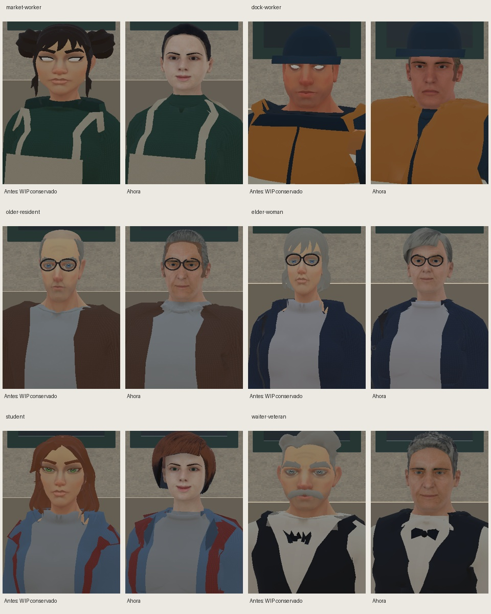
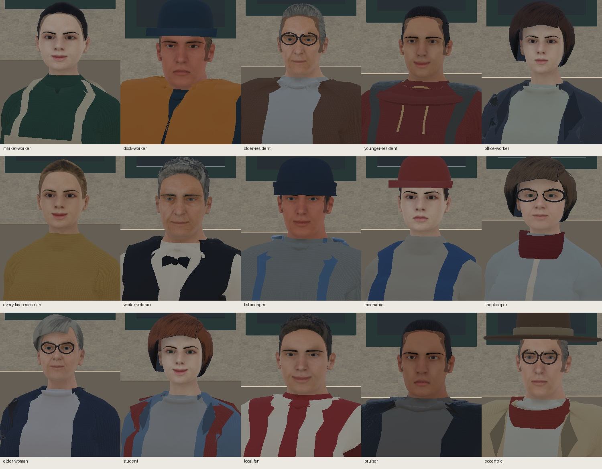
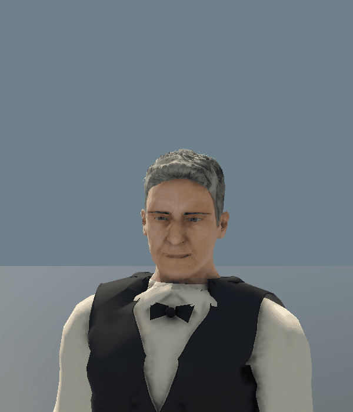
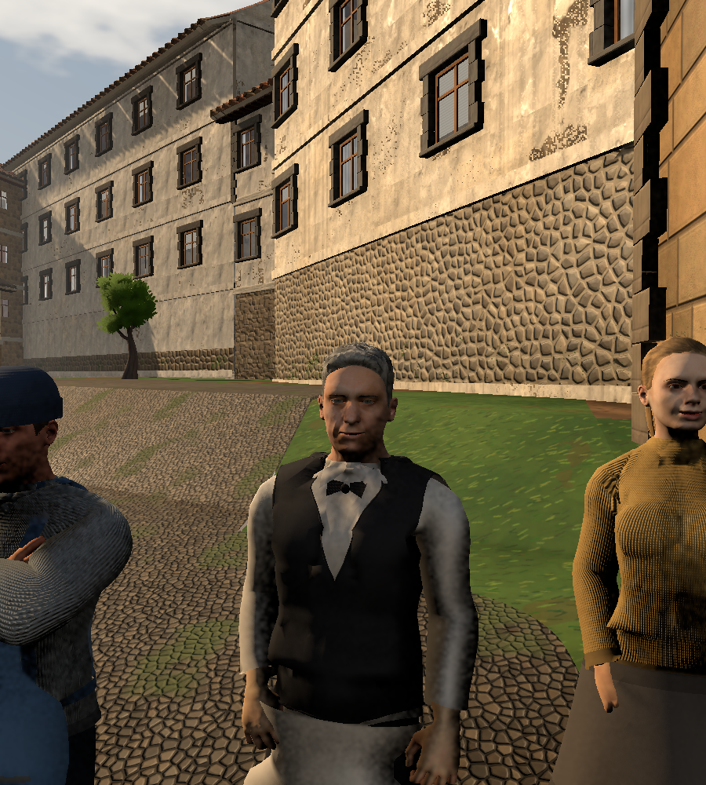
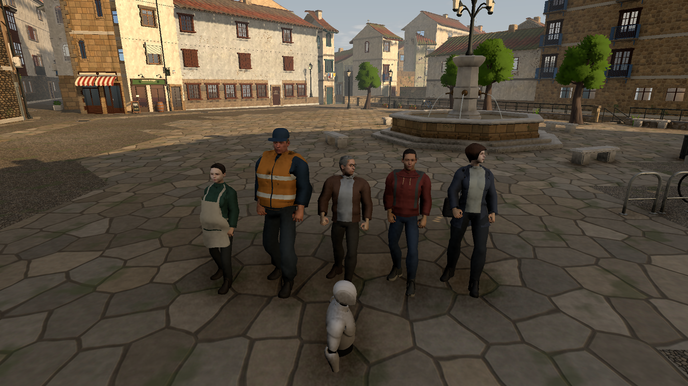

# NPCs — anatomía humana y pulido, 2 de octubre de 2026

Esta pasada sustituye las cabezas rechazadas de Quaternius por anatomía humana CC0 y conserva la dirección de la cara del camarero que el Owner valoró positivamente. Abarca **los quince civiles existentes**: ojos, párpados, cejas, piel, pelo, expresiones, cuello/ropa y presentación viva. Mantiene los IDs, el esqueleto de 65 huesos y la integración Humanoid/ANIM. Es un candidato Worker; quedan la revisión independiente y el juicio artístico final del Owner.

«Antes» es el WIP conservado antes de esta intervención, nunca una versión aprobada. Las cámaras y poses de comparación son comunes. `comparison_before/` y `comparison_after/` conservan 66 PNG cada una: los quince frontales vestidos y sin accesorios de cabeza, tres cuartos/perfil sin accesorios y seis grupos de cuerpo completo/color/silueta. Las cejas anatómicas permanecen en las vistas sin accesorios.

## Cambios de la pasada

- Cabezas, nariz, labios, mandíbula, orejas y párpados anatómicos; formas de edad/sexo/mood explícitas y rostros ficticios. Las fotos de Asturias/Cantabria son referencias de gente corriente, nunca texturas fotográficas ni identidades adoptadas.
- Iris más oscuros, borde limbal contenido y esclerótica integrada. El recorte alpha del material ocular evita los discos blancos de la córnea transparente. Cejas y pestañas siguen la anatomía.
- Color de piel contenido, labios y párpados con variación suave, roughness por regiones y oclusión geométrica poco intensa. Se revisa el volumen de frente, mejillas, nariz y mandíbula con la luz real de ENV, sin alterar esa iluminación.
- Expresiones de reposo acogedoras/alegres, tranquilas o enfadadas según la persona. Mujeres sin geometría de vello facial y sin marcas pintadas que lean como bigote; la fábrica rechaza esa combinación.
- Pelo cotidiano ajustado a la cabeza real: raya, entradas, bob, ondas, coleta/moño, canas y pelo bajo gorros. Las patillas masculinas siguen el lateral anatómico.
- Unión del cuello bajo la mandíbula; pesos de la superficie completa de piel antes de ocultar lo cubierto. El comienzo de las clavículas del bundle no se exporta como cuello visible. El escote se mide después de recortar esa superficie; medirla antes producía las alas blancas en hombros.
- Cuello de camisa vuelto y pajarita por debajo de la mandíbula. Costuras del chaleco continuas entre vértices, redondeo limitado a 6 mm y pesos de la prenda de apoyo. Tirantes de delantal/peto cortados sobre la camiseta con sus mismos pesos y ajustados junto al escote.
- Parpadeo irregular con cierre de ambos párpados, pequeños movimientos de cabeza y ojos hacia el jugador cercano. Respiración y transferencia de peso proceden del idle del Animator existente.

## Presentación viva

`living/LIVING_AUDIT.json` comprueba los quince: cierres completos, cadencias diferentes por persona, mirada izquierda/derecha, objetivos detrás/lejos/ausentes, tiempos inválidos, restauración al desactivar y conservación de root/piernas. `LIVING_LIVE.json` y los PNG registran ocho segundos del camarero ejecutándose normalmente; el GIF respeta sus tiempos. Los tests controlados invocan la misma actualización, pero se etiquetan por separado. `ENV_ATTENTION.json` observa a los quince siguiendo al `Player` canónico de GC2, sin objetivo de preview.

## Comparación con ENV01

`ENV01/` contiene **dieciocho capturas en Play Mode** de una copia del ENV efectivo: tres vistas de jugador y quince a distancia de conversación, en plaza, arco y taller. Conserva renderer, sol, volúmenes y FOV de 55°. La posición se apoya en suelo comprobado; no es evidencia de navegación ni integración final de diálogo.

`ENV_SOURCE_MANIFEST.json`, `CALIBRATION_IDENTITY.json` y la escena de revisión identifican la copia completa y el overlay de CHAR. La escena serializada por Unity se conserva en `ENV01CharacterReview.unity.txt.gz`: al descomprimirla se recuperan exactamente sus bytes, comprobados por SHA-256 y tamaño. El ENV original permanece intacto; otro host necesita ese snapshot exacto para repetir la comparación. Las fixtures de estudio/calle no sustituyen estas vistas. La oclusión y el sol de ENV generan sombras faciales y tejido más contrastado que la fixture de retrato.

## Comprobaciones y límites

- Reconstrucción independiente de los quince: geometría, UVs, suavizado, materiales, pesos, morphs y reposo. Una reconstrucción Unity conserva las identidades serializadas.
- **180 muestras de Play Mode**, 36 hojas frontal/lateral/espalda (**540 vistas**) y **24 hojas a 10/20m**. Cada hoja de distancia concatena tres cámaras separadas de cinco personas.
- **1.080 poses**, **1.575 curvas** protegidas a 64 puntos y **59 negativos**. Las comprobaciones numéricas no certifican por sí solas clipping, expresión ni calidad artística.
- Nueva receta ordinaria en scratch con ID diferente, mismo recorrido y geometría del template cubierto. No se añade un decimosexto NPC al producto.

Las prendas siguen siendo angulares y el tejido pierde detalle a distancia. Delantales/faldas usan superficies ponderadas; no hay simulación de tela o colisión. Permanecen semejanzas entre rostros de una misma base anatómica. La expresión de reposo no es un sistema de actuación facial o lipsync. A 20m/640px se reconocen silueta/ropa; los detalles faciales no son identificables. No se certifican FPS/población, builds de jugador, correr/sentarse/contacto, mezclas arbitrarias ni navegación/diálogo finales.

Ninguna compra ni autoridad de gameplay nuevas. `MANIFEST.json`, los verificadores y la [pre-revisión](../PRE_REVIEW.md) vinculan las pruebas al candidato. El Reviewer fresco deberá intentar falsarlo en el SHA congelado; la aceptación visual final corresponde al Owner.
