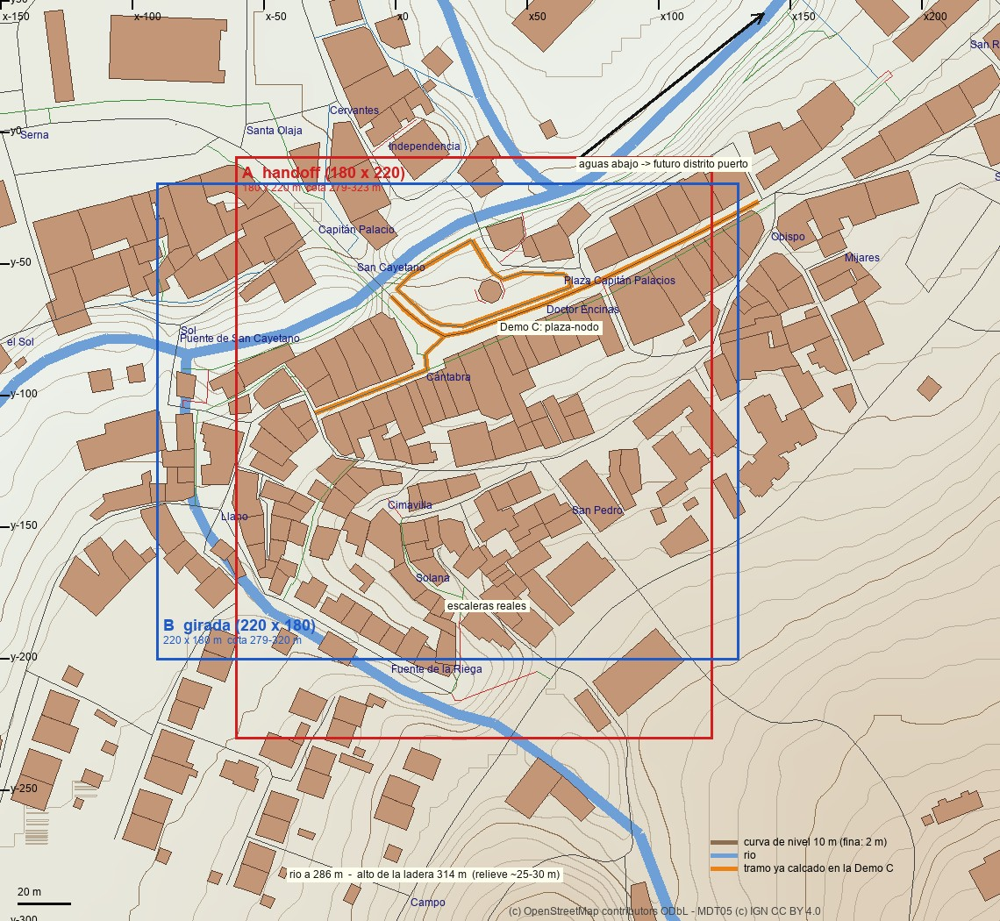
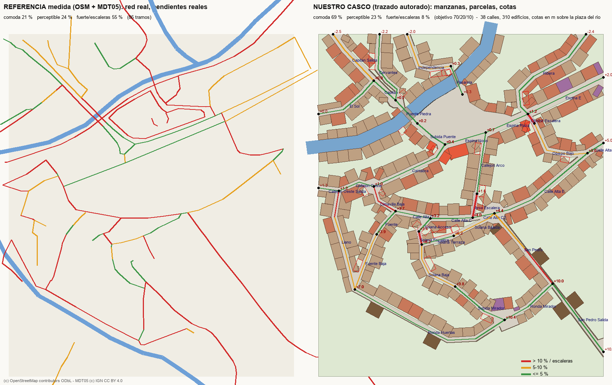

# CASCO reference study — "mini Potes" (WP-PROD-ENV-01)

Date: 2026-09-28. Worker: Claude Code (Opus 5.5), Unity/Blender operator. Owner reviews at every milestone.
Rules distilled from this study: [`../../production/ENV_COMPOSITION_RULES.md`](../../production/ENV_COMPOSITION_RULES.md).

## Question and owner decisions

Round 3 of ENV-01 asked whether a **real urban reference** beats generating layouts from scratch. Demo C
(`ENV01_CascoRef_Potes`, a traced node of the Potes historic core with the casco palette) answered yes and was approved
as direction. The owner then asked to grow it into a whole **CASCO district of ~180 × 220 m** on the real core, deepen
the lebaniego look and raise the quality of our own assets.

| Date | Owner decision |
| --- | --- |
| 2026-09-28 | Potes as strong **morphology** reference for the CASCO, studied with real data; "mini Potes" **palette** too, knowingly against `PORT_TOWN_WORLD_MODEL.md` / `LEGACY_RESEARCH_SOURCE_INDEX.md` wording (**DocSync pending**). |
| 2026-09-28 | The port is another district; only the transition belongs to the casco. Fictional town: no Potes names, signs or named landmarks. |
| 2026-09-28 | **ENV-01 stays open** until the casco district is built and judged (the district is ENV-01's proof, not ENV-02's). |
| 2026-09-28 | Reference **box A**: x −60…120, y −230…−10 around 43.1542, −4.6237 (bbox 43.1521,−4.6244,43.1541,−4.6222). |
| 2026-09-28 | **River: yes, small/medium and channelled, on an edge**, casco on both banks for a short stretch, 1–2 small bridges, a plaza opening to it; downstream to the port. |
| 2026-09-28 | **Slopes/terraces, 70/20/10** (comfortable/perceptible/strong-or-stairs by route length); the town rises from the port. |
| 2026-09-28 | On the measured plan: **"buen referente para el alma del casco; malo como calco literal"** — keep the spine, 2–3 streets with personality, 1–2 descents to the water, corners; stairs as accent; 2–3 breathing spaces; legibility; NPC-friendly. |
| 2026-09-28 | Our derived assets were **below Quaternius level**: quality pass on all of them; style photos (Potes street to the river plaza; Pyrenean commercial lane) given as targets (kept out of the public repo; traits in the rules doc). |

## Data and tools

- OpenStreetMap via Overpass (`Tools/env_morphology.py fetch`, now with node ids): buildings, streets, waterways.
  Derived data carry "(c) OpenStreetMap contributors, ODbL 1.0"; raw extracts stay out of the repo.
- Terrain: IGN **MDT05** (5 m) through the IDEE WCS (`Tools/env_district.py dem`), "MDT05 (c) IGN, CC BY 4.0".
  Street level = median of the DEM in a 4 m disc (a channel or terrace wall beside a street must not drag it down);
  grade = 75th percentile of 10 m windows.
- `Tools/env_district.py measure/plan`: street graph (junctions, stretches, widths facade to facade, grades), urban
  blocks, footprints. `Tools/env_district_skeleton.py`: authored trace → Unity district spec (below).

## The reference (box A)

| Measure (inside box A) | Value |
| --- | --- |
| Walkable network | 2 187 m, 86 stretches, 28 T and 1 X junctions |
| Buildings / built share | 145 footprints (median 8.3 × 13.2 m) / 41 % |
| Relief of the network | 281–315 m (river walk to the upper Solana) |
| Grade share by length | **21 % comfortable, 24 % perceptible, 55 % strong or stairs** |

Street-level measures of the Demo C study (percentiles 10/50/90) still hold: main street 5.6–6.5 m between facades with
jogs > 0.5 m in 29 % of neighbour pairs and 50–70 m stretches bending 5–10°; secondary 4.5 m; lanes 2.4–4.8 m with
jogs in ~70 % of pairs and bends up to 128°; the linear plaza 13–29 m by the river.

## Our district (authored over the reference)

| Measure | Reference | Ours |
| --- | --- | --- |
| Network | 2 187 m, 86 stretches | 1 438 m, 38 streets (spine, 4 secondary, lanes, 3 stair accents, stone bridge + footbridge) |
| Grade share (comfortable / perceptible / strong+stairs) | 21 / 24 / 55 % | **69 / 23 / 8 %** |
| Relief | 34 m | river water −3.0 → upper edge +10.4 m (river plaza = 0) |
| Blocks / buildings | 25 faces / 145 footprints | 18 blocks / 311 plots from the real subdivision, 36 garden walls |
| Breathing spaces | — | river plaza (tower, bar terrace, parapet, stair to the water), calle alta plazuela (fountain), upper mirador, north bridgehead, west triangle |

Key authored moves: the river kept as the Quiviesa's edge course but narrowed to a 9 m stone channel that turns north
towards the port; the Demo C node kept (plaza, singular tower closing the spine, narrower axis-shifted continuation,
bar chamfers); a new central passage through the 150 m spine block for continuity; the Solana tangle reduced to one
terrace lane, one lower lane and a mirador; the modern south-east reinterpreted as huertas with casonas behind stone
walls; the stream and its street at the south edge replaced by a ronda above the huertas.

## Build (Unity)

`JuegoDef > ENV > 7 Build District (CASCO)` or the chunked calls `EnvDistrict.Begin/BuildRows/Finish` (≈4 s for 311
buildings, 66 k objects): heightfield ground by paving zone, one facade row per block edge with the street assembler's
party-wall rules (now aware of neighbour heights), stone bases on sloping ground, garden walls, river walls,
parapets, stone arches under the bridges, stairs, stair to the water, fountain, garden trees, valley backdrop with the
sea to the north, GC2 player and a route probe over the whole authored tour. The ~95 MB scene is rebuilt from the spec
and not committed.

Milestone captures: [H1 skeleton](reference/casco_district_skeleton.png) ·
[H2 first build](captures/district/H2_first_build_sheet.jpg) · [H3 asset lab](captures/district/H3_asset_lab_sheet.jpg) ·
[H3 district](captures/district/H3_district_potizado_sheet.jpg).

## Answer

Tracing the real core fixed what generated layouts could not (bends, jogs, narrow deep plots, closed views, a node
with a landmark). Growing it to a district confirmed the owner's caution: a literal trace is too steep and too
fragmented to play; the soul survives an authored simplification that keeps the spine, the water edge, the node and a
few characterful lanes, and moves most of the relief into short stair accents.
