# WP-PROD-ENV-01 evidence — Environment Asset + Assembly Factory

Date: 2026-09-28. Worker: Claude Code (Opus 5.5) as Worker + Unity/asset operator (MCP for Unity 10.2.0, Unity 6000.3.24f1, headless Blender 5.2.1). Authoritative workflow: [`Docs/production/ENV_FACTORY.md`](../../production/ENV_FACTORY.md). This is Worker evidence; independent review is still required.

## Claim → evidence

| WP requirement | Evidence |
| --- | --- |
| 1. `ENV_FACTORY.md` | [`Docs/production/ENV_FACTORY.md`](../../production/ENV_FACTORY.md) |
| 2. `REUSE_DECISIONS.md` (bounded tests before custom tooling) | [REUSE_DECISIONS.md](REUSE_DECISIONS.md): Medieval kit, `osm_building_grammar` (run in Blender 5.2), QuaterniusUnityUtils, `game_export` (registered in Blender 5.2), Material Batch Tools, Auto/Geo-Buildings, Unity native import, Blender headless |
| 3. Lane semantic catalogue/tags on PROD-ASSET-00 | `Docs/asset_catalog/env_library.json` (units: demand rows, size, request, bill of modules), `env_derive_manifest.json` (derived modules: class, donors, method), `python Tools/env_catalog.py search/modules`; kit modules keep their PROD-ASSET-00 IDs |
| 4. Reusable owned prefab/module library | `Unity/JuegoDef/Assets/JuegoDef/Derived/ENV/`: 43 derived meshes, 65 module prefabs (43 derived + 22 collider/material wrappers of Props/Nature models), **19 production units** ([INVENTORY.md](INVENTORY.md), [unit previews](units/)) |
| 5. Material/palette adaptation system | `Env/Grammar/materials.json` + `palettes.json` → 39 owned materials + 4 neutral textures, 8 palettes, role-based slot remap (`JuegoDef > ENV > 1 Generate Materials`) |
| 6. Donor extraction / derived path | `Tools/blender/env_derive.py` (43 recipes, ~6 s); worked example below |
| 7. Assembly templates/rules | `FacadeGrammar` (frontage types, bay codes, rhythms, one-balcony rule), `BuildingAssembler` (layered assembly, party walls, quoins, verges), `EnvTemplates` (street ground, quay edge, yard boundary, stepped connector, interiors), `EnvStreet` (street specs) |
| 8. Cheap validation | `EnvValidator` → [VALIDATION.json](VALIDATION.json): **0 problems** over 19 units + 2 street scenes; **self-test 6/6 seeded defects detected**; `env_catalog.py check` and `asset_catalog.py validate` clean |
| 9. Non-trivial factory batch | 19 units across 13 demand rows (buildings of 5 frontage types, shop/lodging interiors, street/lane ground, stepped connector, public quay, controlled yard, market/port/furniture clusters, frontage vocabulary) + 2 materially different streets built from specs |
| 10. `B0_COVERAGE.md` | [B0_COVERAGE.md](B0_COVERAGE.md): every ENV demand row has a validated unit; bounded gaps listed |
| Captures / previews | [units/](units/) (19), [captures/](captures/) (streets A1–A6, B1–B3, derivation D1–D2, iteration I1–I4, Play Mode P1) |
| Validator results / route probes | [VALIDATION.json](VALIDATION.json), [ROUTE_PROBES.md](ROUTE_PROBES.md): street A **12/12**, street B **8/8**, 0 stalls, GC2 player |
| Dependency check | [DEPENDENCY_CHECK.md](DEPENDENCY_CHECK.md) |
| Lineage | `Docs/asset_catalog/lineage.json`: 170 ENV records (DONOR 22, CREATE_DERIVED 59, ADAPTABLE 51, ORIGINAL 38); PROD-ASSET-00 catalogue rebuilt so sources expose `derivedIds` |

## Two materially different streets from the same factory

| `ENV01_DemoA_Commercial_To_Quay` (kerbed, 42 × 8 m) | `ENV01_DemoB_Upper_Lane` (pedestrian, 28 × 6 m) |
| --- | --- |
| 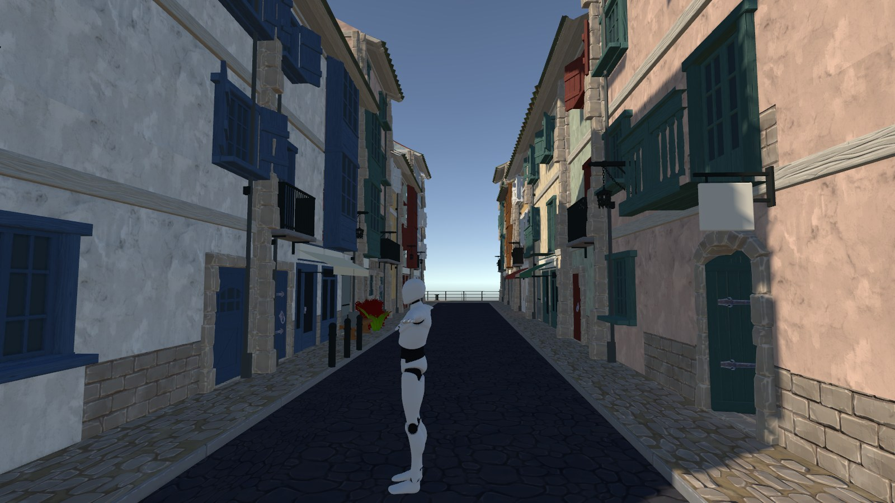 | 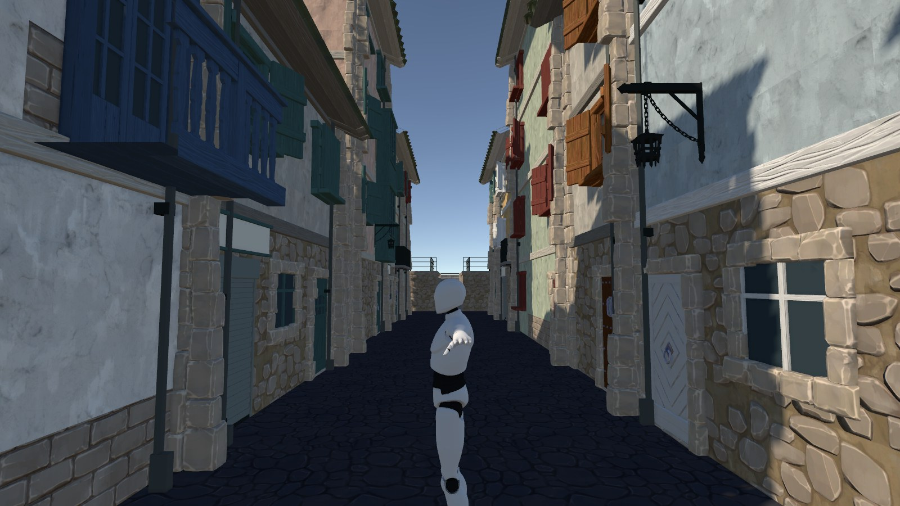 |
| 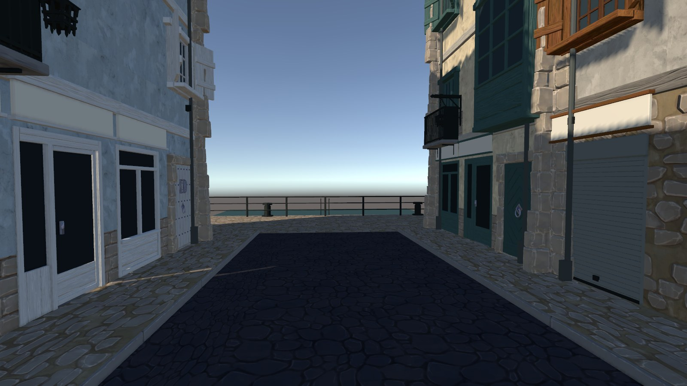 | 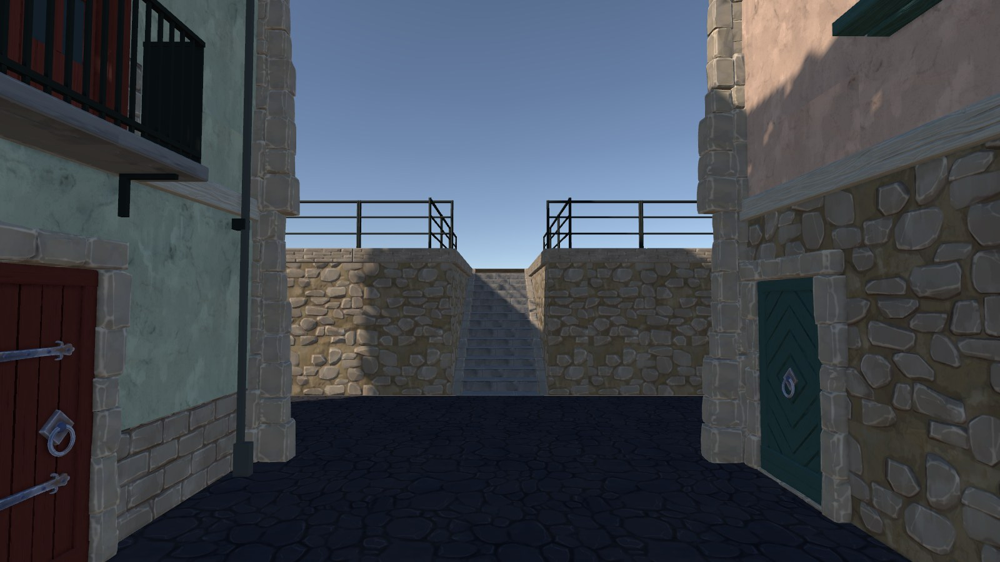 |
| 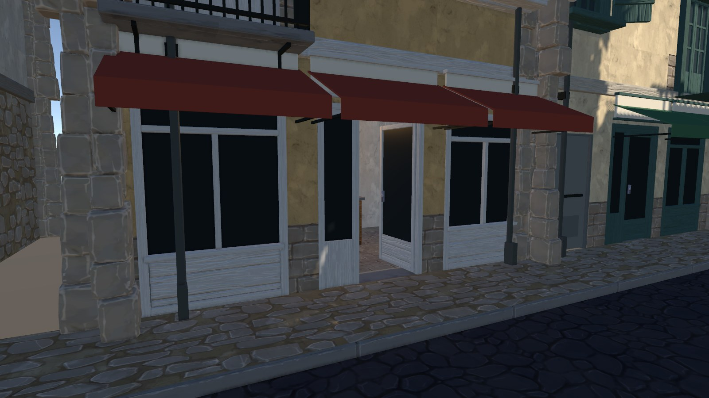 | 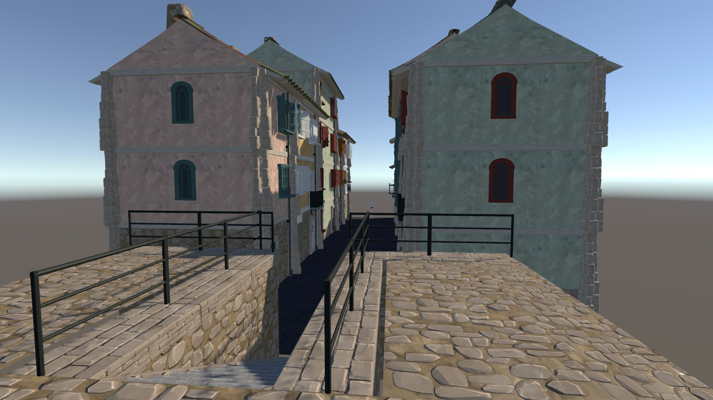 |
| 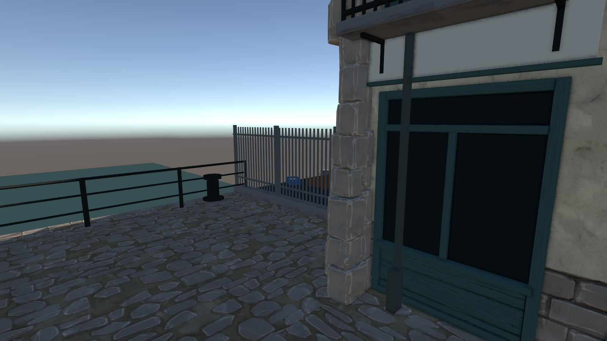 | 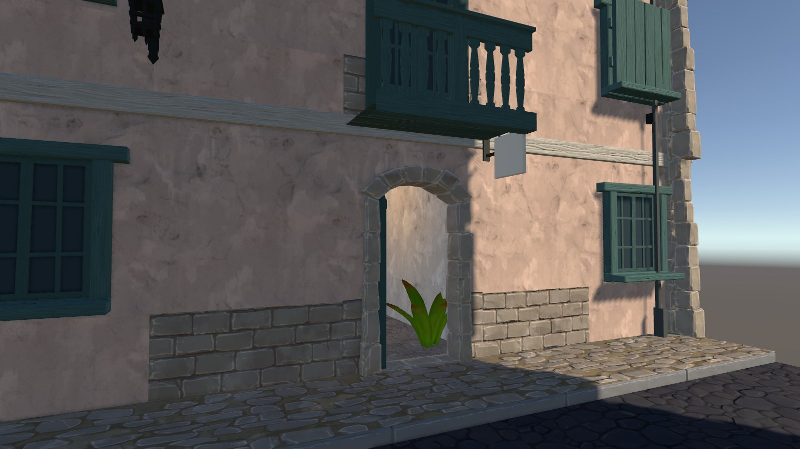 |

Both are requested as data (`Env/Specs/streets/*.json`) from library unit IDs plus overrides; no scene-specific code or exact object paths. They are composition tests of the factory, **not** B0 keeper geometry (that is `WP-CITY-URBAN-01`). Play Mode through the GC2 camera: 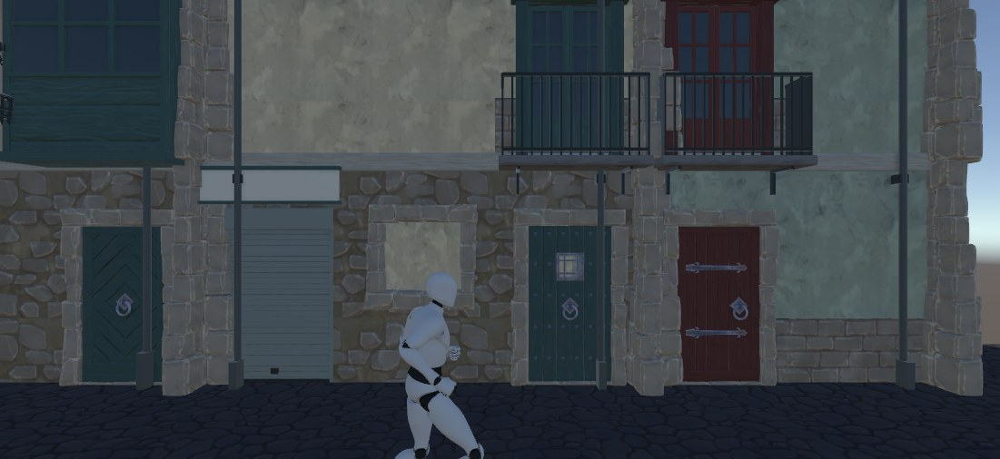

## Worked donor → final example

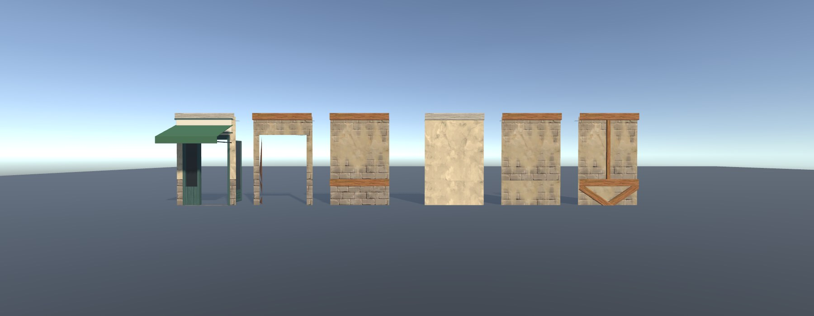

Read right to left: kit `Wall_Plaster_Straight` (timber braces/post — alpine cue) → `ENV_Wall_Plaster_Clean` (`clean_plaster()`: loose `MI_WoodTrim` parts deleted except the floor-line band; the plaster plane is continuous behind) → same wall with the `cream_green` palette → kit `Wall_Plaster_Straight_Base` → `ENV_Wall_Plaster_Shopfront` (cleaned + 1.6 × 2.38 m boolean cut, hole-tolerant exact solver, stone reveals) → dressed with `ENV_Shopfront_Door_Open` (flush threshold, 2.22 m clear), fascia and awning, palette-remapped. Lineage record: `env:meshes:ENV_Wall_Plaster_Shopfront`, class `DONOR`, sources `medieval:wall_plaster_straight_base`, … (materials traced automatically).

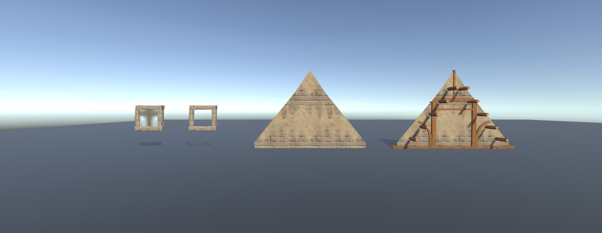

Right to left: kit `Roof_Front_Brick6` (half-timbering + projecting purlins) → `ENV_Roof_Gable_6`; kit `Window_Wide_Flat_Rocks` (stone surround only — the empty building showed through) → with the derived `ENV_Window_Insert_Wide` sash measured on the donor wall opening.

## Iteration history (owner reviews during the session)

| I1 kit pieces as-is | I2 derived frontage | I3 after "ojo con tantas puertas arriba" | I4 after "compáralo con fotos reales… dejar respirar" |
| --- | --- | --- | --- |
| 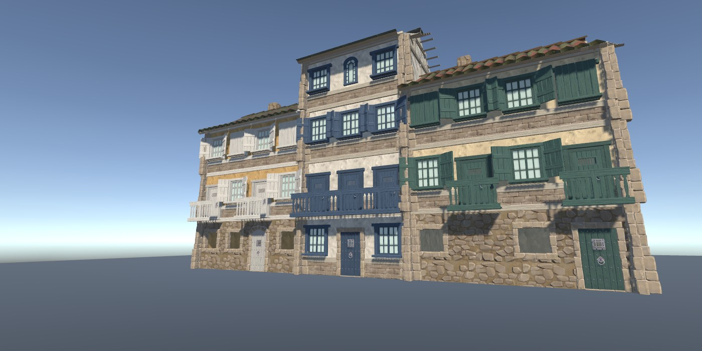 | 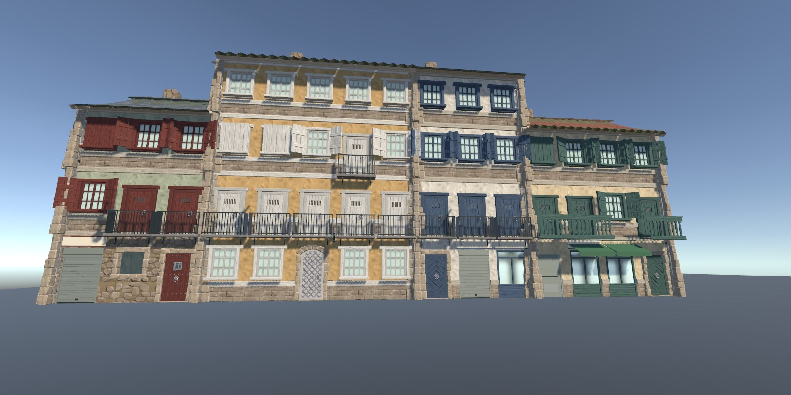 | 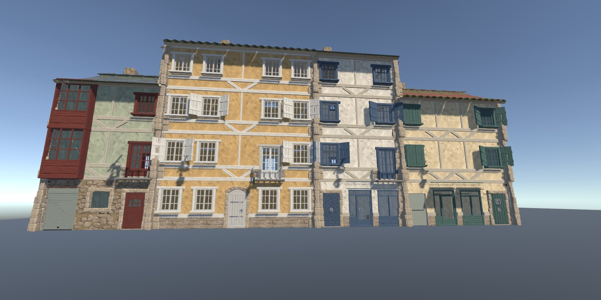 | 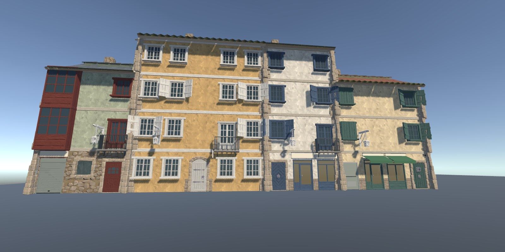 |

## Operator log — failures and corrections

| # | Failure | Diagnosis | Correction (kept in the factory) |
| --- | --- | --- | --- |
| 1 | No JuegoDef editor attached to MCP | only another project was open | launched the project editor; pinned instance `JuegoDef@9bfcb657` |
| 2 | Local Medieval copy from the archived attempt had a foreign receipt | old provisioning script | moved it aside, reinstalled via accepted `asset_catalog.py install` |
| 3 | Props/Nature 100× scale | intake minimal `.meta` ignores FBX file scale | `EnvImportRules` (useFileScale) |
| 4 | Every prop rendered white | textures imported as Cubemap; materials generated locally with random GUIDs | `EnvImportRules` 2D textures + owned `ENV_Src_*` materials in wrappers |
| 5 | Plaster palettes all brown | `M_Plaster` base texture non-modifiable + brick-reveal masks | owned plaster on `M_BaseWear` + neutral textures |
| 6 | Half-timbering and purlins everywhere | kit walls/gables carry timber parts | derived clean walls/gables; validator bans the originals |
| 7 | Derived pieces mirrored in Z | kit export = source rotated 180° | `U()` + `export()` rotation |
| 8 | Boolean cut kept cutter geometry | kit walls are open shells | exact solver, hole tolerant |
| 9 | Too many windows/doors upstairs | grammar gave every bay an opening/balcony | one-balcony rule; rhythms calibrated on real Cantabrian/Galician photos |
| 10 | Stone windows showed empty interiors | kit "Rocks" window is only a surround | derived glazed inserts |
| 11 | Shop door not walkable (4 separate causes) | leaf swing, sill, head height, floor slot | see [ROUTE_PROBES.md](ROUTE_PROBES.md); validator now checks with the real capsule |
| 12 | Beige shop glass | emission under project exposure (not reflections) | no emission on shop glass; streets bake a reflection probe |
| 13 | Lineage over-attributed a flat material to a kit door | shared shader GUID was treated as a source | lineage traces textures only; kit material → representative module table |
| 14 | MCP bridge dropped once during a long call + recompile | long synchronous call | split pipeline calls |

Counts: owner manual clicks **0**, exact-path hints **0**, owner interventions **2 visual reviews** (both folded into grammar rules). Escape hatches: `execute_code` for pipeline runs, runtime probes and captures.

## Repeatability boundary

Vendor bytes stay ignored; on a clean clone: intake (`install --pack medieval|props|nature`) → open Unity (import rules apply on first import) → `JuegoDef > ENV > 1…5`. Committed derived meshes carry their `.meta` material remaps to vendor GUIDs (deterministic from the admitted archive/intake). Re-running Blender recipes rewrites FBX bytes (timestamps) but not GUIDs or geometry semantics.

## CASCO district (owner request 2026-09-28: grow Demo C into a ~180 × 220 m "mini Potes" casco)

ENV-01 stays open until this district is built and judged (owner decision). Study, decisions and numbers:
[CASCO_REFERENCE_STUDY.md](CASCO_REFERENCE_STUDY.md); rules: [`ENV_COMPOSITION_RULES.md`](../../production/ENV_COMPOSITION_RULES.md).

| Milestone | Result | Evidence |
| --- | --- | --- |
| H1 skeleton | authored network over the measured Potes core (box A): 38 streets, 18 blocks, 311 plots from the real subdivision; grades **69/23/8 %** vs the reference's 21/24/55 % | [plan](reference/casco_district_skeleton.png), [box options](reference/casco_district_box_options.jpg) |
| H2 first build | `EnvDistrict` builds the whole district from the spec in ~4 s: heightfield ground, rows on the terrain with stone bases, garden walls, channelled river, bridges, stairs, plazas, player | [sheet](captures/district/H2_first_build_sheet.jpg), [top view](captures/district/H2_top_view.jpg) |
| H3 asset quality + lebaniego vocabulary | painted textures instead of flat colours; street pieces rebuilt to kit level; canecillo eaves, solanas, ashlar quoins on seen corners only, sandstone surrounds, casona shield; canto rodado with a central flag strip; far fewer downpipes | [asset lab](captures/district/H3_asset_lab_sheet.jpg), [district](captures/district/H3_district_potizado_sheet.jpg) |
| H4 composition | tower closing the spine, stone arch bridges, stair down to the river, plazuela fountain, huerta trees, valley backdrop with the sea to the north, route probe over the whole tour | [sheet](captures/district/H4_composition_sheet.jpg), [route](ROUTE_PROBES.md#casco-district) |

## Owner visual audit of the CASCO (2026-09-29, 45 points) — look pass

Brief: turn the casco from "a well-dressed blockout" into a believable, memorable place without redoing the layout;
PS2+/Quaternius, not photoreal. **The morphology is unchanged**: same spec, same plots, heights and levels; every change
is in the factory (materials, grammar, character pass, dressing, lighting). No street or block was moved, so no
morphology justification was needed. Mid-session owner notes folded in: Blender pieces must reach Quaternius level;
materials still too homogeneous inside a family, missing localized weathering, fog hiding the work; "otra vez locos
con tantas puertas y ventanas".

Fixed review viewpoints: `Env/Specs/districts/ENV01_Casco_District.shots.json` (`EnvShots.Capture`); sheets with
`Tools/env_sheet.py`. Before = the scene as rebuilt at the start of the session (commit `af22bd3`).

| Before → after (1) | Before → after (2) | After: close-ups |
| --- | --- | --- |
| 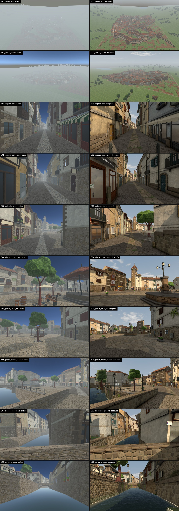 | 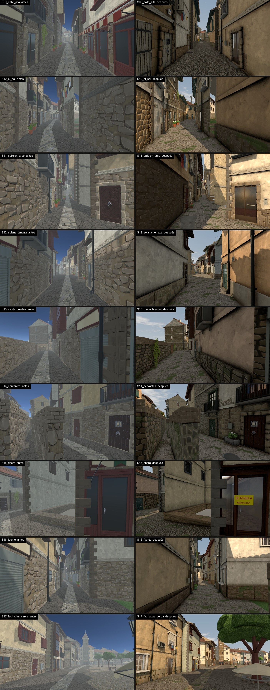 | 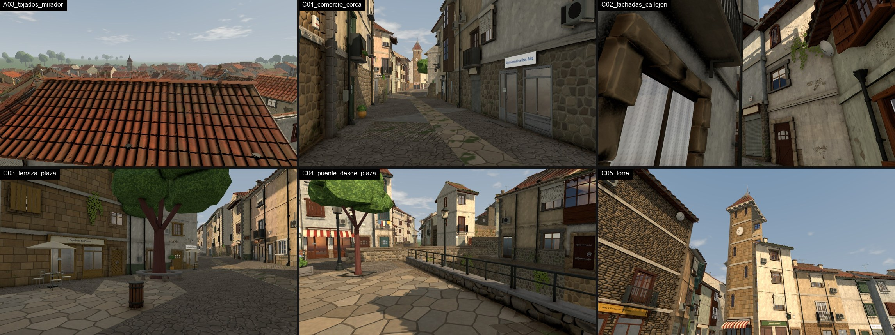 |

### What changed in the factory

| Area | Change | Where |
| --- | --- | --- |
| Materials | `JuegoDef/ENV/Weathered Lit`: world-space macro tone/hue, stone-scale tone, rising damp (storey or river water line), rain streaks, moss, repair patches, flaking render; per-material seed and jittered amounts. Families: render 10 hues × 4 conditions × storey, masonry 5 bonds × 4 tones × storey, dressed stone, river walls, paving | `Env/Shaders/ENV_WeatheredLit.shader`, `materials.json` families, `EnvMaterials.ExpandFamilies` |
| Textures | 8 generated masonry/paving bonds on 4 m tiles (rubble, river stone, ashlar, slabs; canto, flags, setts, plaza slabs); weathering noise; stain atlas; water ripples | `Tools/env_masonry.py`, `Tools/env_textures.py` |
| Facade families | render / zocalo / stone_ground / stone / rehab / modern by street kind; quoins ashlar, slim (new module), painted or none; plinths at 0.4–1.3 m in stone or paint; joinery (14 colours), roof tiles (6 ages), pitch, fewer solanas | `EnvCharacter`, `BuildingAssembler` family fields, `ENV_Quoin_Slim` |
| Openings | shops = door + ≤ 2 display windows; homes = portal + one window or garage; sparser upper rhythms; fewer balconies/galleries. Measured on the district: ground bays open 64 % → 51 % (most of the rest is each narrow house's portal), upper 45 % → 36 %, balcony/gallery doors 282 → 163 | `FacadeGrammar.Rhythms/Generate`, `EnvBusiness.RewriteGround` |
| Weathering by cause | downpipe splash, sill streaks, rust under iron balconies, corner run-off, damp/algae bands, repairs, soot; density by condition | `FacadeGrammar.Weathering`, `ENV_Stain_Quad`, `Env/Shaders/ENV_Stain.shader` |
| Contemporary layer | air conditioning, alarms, intercoms, enamel house numbers, extractors, telecom boxes, gas risers, recycling bins, bike racks, manholes and gully grates, bollards, pedestrian-zone sign — clear of openings and downpipe lines | `FacadeGrammar.Contemporary`, `EnvDistrict.StreetFurniture`, new modules |
| Ground-floor programme | 56 fictional businesses + garages, workshops, closed shops, homes, hostals by street kind; one fascia per shop run with lettering; blade signs with trade icons; pharmacy cross; ATM; chalkboards; goods and barrels at the door; "SE ALQUILA", "VADO PERMANENTE", opening hours; faded fascias; painted adverts on blind side walls | `EnvBusiness`, `Env/Grammar/businesses.json`, `Tools/env_signs.py`, `Derived/ENV/Signs` |
| Glass | fake interiors on every pane (homes: living room, kitchen, bedroom; shops: bar, shop, pharmacy, bakery, office, workshop, empty) with net curtains, blinds at different heights, controlled Fresnel reflection | `EnvInteriors` (+5 rooms, per-opening variants), `ENV_InteriorRoom.shader`, `BuildingAssembler.GlassRoom` |
| Plants | rarer, by street; hydrangeas, ferns, geraniums, box, bay laurel in terracotta, glazed pots, tins, troughs, timber boxes; stone benches by old doors | `FacadeGrammar.Plants`, new plant/pot modules |
| Paving and contact | paving by reason (flag strip only on the main spine, canto variants, setts on bridges, flags + cobbled rim on the plaza, repair patches); lane drainage channels and flag bands along facades; door steps and shop thresholds | `EnvDistrict.PaveOf/PavingOverlays`, `FacadeGrammar.Thresholds` |
| Plaza | fountain monument with a five-lantern candelabra (landmark), the old plane tree with ring bench, riverside walk (trees in a line, benches facing the water), bar terraces, planters with hydrangeas | `EnvDistrict.DressPlaza`, `ENV_Fountain_Monument`, `ENV_Tree_Singular` |
| River | stylised water with depth, ripples along the flow, foam at edges and rocks, Fresnel reflection; cobble bed; rocks; channel masonry by stretch with water line, algae band, moss; drains, ferns, ivy, weeds; stone parapets, lamps and ivy on the bridge | `Env/Shaders/ENV_RiverWater.shader`, `EnvDistrict.Finish/RiverRocks/RiverWallLife/Bridge` |
| Tower | ashlar and rubble, aged tiles, two clock faces, bells, weathervane | `BuildingAssembler.TowerIdentity`, `ENV_Clock_Face`, `ENV_Bell`, `ENV_Weathervane` |
| Edge | patchwork huertas/yards; dry-stone field walls with hedgerow trees and stone barns round the town | `EnvDistrict.PaveOf`, `Backdrop` |
| Lighting | `JDLightingRig` wired: day / dusk / night (F9), linear fog from 45 m, Atlantic sky shader (horizon = fog colour, clouds), lower warmer sun, darker ambient, SSAO at building scale (was 3.5 cm), 3 shadow cascades / 90 m, lamp and lantern lights, a baked probe per preset | `EnvLighting.BuildRig`, `Env/Shaders/ENV_SkyAtlantic.shader`, `JDLightingRig` |

### Status by audit point (Worker's reading; the owner judges)

| Status | Points |
| --- | --- |
| Addressed | 2 stone band · 3 stone uniform · 4 flat render · 6 contemporary · 8 generic shops · 9 black glass · 10 blank signs · 12 pots · 13 repetitive paving · 14 light strip · 18 plaza trees · 19 plaza landmark · 22 water · 23 sterile channel · 27 flat light · 28 fog · 29 sky/fog · 31 humidity · 35 function · 41 tower · 43 prop rhythm |
| Partly (new-piece surface quality below Quaternius, see below) | 1 kit formula (families; door/window models are still the kit set) · 5 roofs (tile ages, chimney kinds; no gutters, dormers or roof repairs) · 7 fantasy timber (fewer solanas, slimmer corners) · 11 doors/windows (joinery colours only) · 15 contact (steps, thresholds, bands, covers) · 16 micro-detail (recycling points: none fits off the walking lines of the small plazas yet) · 17 plaza (sub-spaces; no level change) · 20 street identity (by kind; no bespoke sequences) · 21 long walls · 24 bridge (parapets, lamps, ivy; no cutwaters or new street junctions) · 25 river experience (riverside walk only) · 30 local contrast · 32 too clean · 33 window depth (interiors; no deeper reveals) · 34 domestic life · 36 roofs from above · 37 green voids · 38/39 edge and exterior · 40 hero vs filler · 42 palette · 44 storytelling |
| Open | 26 levels and terraces — needs small geometric work (raised pavements, stepped forecourts, plaza platform); proposed for the next pass |

### Validation

- `JuegoDef > ENV > 5 Validate`: **0 problems** (19 units + district; 418 thresholds checked); self-test **8/8**. One
  real defect class found and fixed on the way: downpipes crossing new wall additions (intercoms, a geranium) —
  additions now keep clear of every downpipe line.
- Route probe (Play Mode, GC2 player): **139/139, 0 stalls, 917.5 m** on the final build. The run before it caught a
  real defect (recycling bins placed on the lane through the Plazuela Oeste, 138/139) — fixed at the source (street
  furniture keeps off every walking line); see [ROUTE_PROBES.md](ROUTE_PROBES.md#casco-district).
- Frame at street level in Play Mode (editor, this machine): ~4.9 ms, 3.2k batches.

### Asset quality (owner: "los assets de Blender tienen que estar al nivel de los Quaternius")

Honest reading of the lab row ([asset_lab_new_pieces.jpg](captures/audit/asset_lab_new_pieces.jpg): Quaternius barrel,
crate and bench on the left, then the new pieces): silhouettes and scale are right and they hold up in the district
views, but **they are below Quaternius level in surface detail** — flat owned colours instead of painted trim-sheet
detail; the hydrangea and the stone trough/bench are the weakest. A quality pass (kit trim-sheet UVs, painted
detail, more bevel/shape breakup) is open before these count as keeper assets.

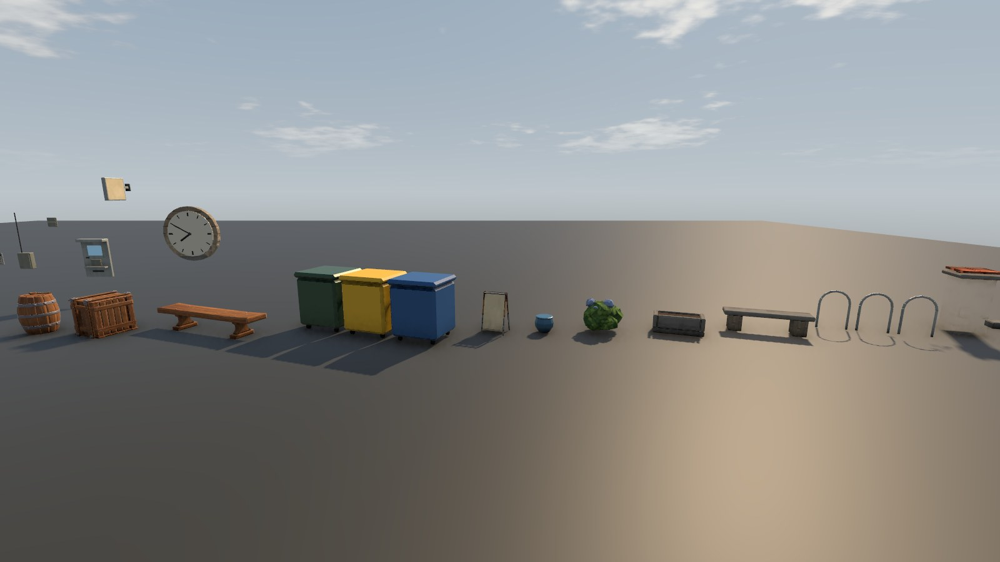
